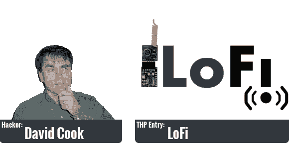
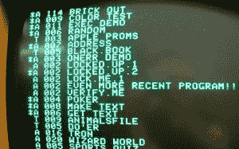

# THP 黑客传记:戴维·库克

> 原文：<https://hackaday.com/2014/06/26/thp-hacker-bio-david-cook/>

[戴维·库克]已经在头版与粗糙的黑客多次。我们很高兴将[他的黑客项目简介](http://hackaday.io/hacker/8416)作为本周的黑客传记。

他的黑客日奖(Hackaday Prize)参赛作品(T1)是一种对联网设备(T2)的“一对无线规则”方法，他称之为 LoFi(T3)。我们为[的第一个演示视频](https://www.youtube.com/watch?v=cbPQeBRzE48)感到高兴，这正是我们对初步参赛作品的预期；[David]解释了这一概念，以及他计划如何使用一些视觉辅助工具来实现这一概念。

休息之后加入我们，了解更多关于[David]的信息。哦，如果你想知道他在 Hackaday 上出现的次数，看看[他的电容器/硬币电池交换](http://hackaday.com/2010/03/27/swapping-coins-cells-for-capacitors-for-noise-filtering/)，这是我们的最爱之一。

机器人学、机械加工和电子学。

写商业软件。

应用科学。我们什么时候去火星！冥王星特写看起来像什么？那些小行星里有金子吗？

当我和妻子年轻、天真、刚结婚时，我们被一家管道公司骗了，这家公司重做了我们第一个家和院子里的所有管道。不用说，天气一变，到处都是漏洞。我知道这看起来不像是一个疯子用棒球棒敲打地下室铜管的画面，但事实就是如此。又漏了！？！你在开玩笑吗？？

 苹果 DOS 3.3。那是我第一次学编程。我对 Apple BASIC、Beagle Bros 和 GPLE 有着美好的回忆。我“终于成功了”的时刻之一是沃兹买了一份我的游戏《MacSki》。无论你在哪里，谢谢沃兹。[图片来源:[沃克·桑普森](https://wsampson.wordpress.com/2010/07/01/vintage-computing-equipment-who-will-have-you/)

我有一个漂亮的金属烙铁，是我哥哥给我的。我的办公桌上总有一个自制的电流控制 led 测试仪和环光放大镜。但是，我不会说出我的万用表、示波器、电源、数码相机的名字，因为我对它们很失望，它们也知道为什么。

Atmel AVR 8 位线路。我更喜欢老摩托罗拉 68HC08 CISC 冯诺依曼建筑，但阿特梅尔真的关心他们的产品线和爱好者社区。

我喜欢 C#。普通系列近乎神奇。在此之前，我是 C 的忠实粉丝，但现在我被宠坏了。

在面试的这一点上，我需要给你提供一张我的壁橱、地下室和地板上的箱子的照片。然后你就会明白我为什么说“我只能选三个？？？时间冻结，自我复制，或者超高速算吗？”

![[David's] metalworking to motorize a PCB shear.](img/28fb572c834ffa566ae5a2596024e342.png)

【大卫】机械加工项目[电动化一台 PCB 剪切机。](http://hackaday.com/2013/08/29/fail-of-the-week-motorizing-a-pcb-cutting-shear/)

加工金属，毫无疑问。你不知道从一块木头上切下金属来制作你想象中的真实的东西是多么令人满足。当他们拿着一个你为你的机器人做的不寻常的支架时，割伤、疼痛和油腻的手不会感觉那么糟糕。亚军将是种植自己的食物。两者都很先天。

我想衡量或监控很多事情，但我没有时间去完成所有这些项目。因此，[一个紧凑的通用阅读器(没有编程，没有定制板)和发射器](http://hackaday.io/project/1552-LoFi)让我用我妻子不会反对的预算满足了大部分这些愿望。

可能是使用 Chrome.Serial 读取和设置配置的 Javascript。我可以做到这一点，但我讨厌 Javascript。天啊。我有一个打印错误，但你不打算告诉我，直到有人试图使用它？即使这样也不会有错误信息吗？抱歉 Javascript，不是我，是你。

我想要一个有更好固件的坚固的家用路由器。我听到了这种事情的暗示，但我希望看到有人能振作起来。

我想要一个私人的登月运载系统。你觉得那需要几个长周末？

家庭、编程、m&ms、写作、游戏

黑一天很酷。