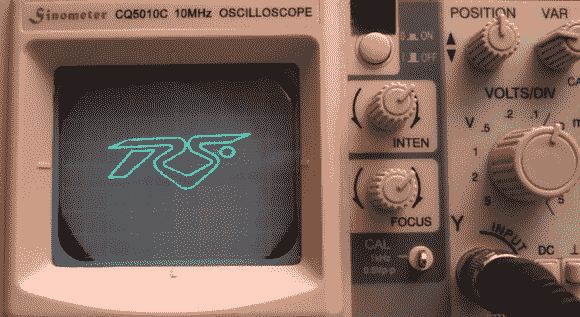

# 光束:示波器演示

> 原文：<https://hackaday.com/2014/06/27/beams-of-light-an-oscilloscope-demo/>

demoscene 依然活跃，新的演示在众多平台上出现，[包括示波器](http://www.pouet.net/prod.php?which=63587)。光束是[TRSi]在波斯顿的 [@party](http://atparty-demoscene.net/) 上发布的新试玩。光束不是通常的。用于基于 PC 的演示的 EXE 文件格式。它以 4 通道波形文件的形式分发。后左右声道是立体声音频。然而，前通道是以 XY 模式在示波器上显示的矢量视频。

Beams of Light 并不是第一个使用示波器的演示。之前有示波器和 T2 示波器。尽管如此，你可以看到[TRSi]在他的创作上有点突破。他使用 Processing 和 Audacity 来创建矢量视频，并使用自己的线跟踪算法来减少回扫线。

[TRSi]包含了一个基于 python 的示波器仿真器的更新版本，因此即使您没有必要的硬件，也可以播放演示。我们希望以正确的方式运行它，所以我们给我们值得信赖的 Tektronix 465 加电，并将其连接到 1/8”立体声插头上。

果然试玩玩了，很荣耀。我们确实看到了一些比视频显示更多的回撤线。这可能是因为我们的示波器比 YouTube 视频中使用的 10MHz 示波器具有更高的带宽。XY 演示是为数不多的模拟示波器比低成本数字示波器效果更好的例子之一。至少可以说，在我们的 Rigol ds1052e 上尝试演示并没有产生非常好的结果。有时好的老磷光体只是击败了模数转换器。

[https://www.youtube.com/embed/lVdWxKZVYC0?version=3&rel=1&showsearch=0&showinfo=1&iv_load_policy=1&fs=1&hl=en-US&autohide=2&wmode=transparent](https://www.youtube.com/embed/lVdWxKZVYC0?version=3&rel=1&showsearch=0&showinfo=1&iv_load_policy=1&fs=1&hl=en-US&autohide=2&wmode=transparent)