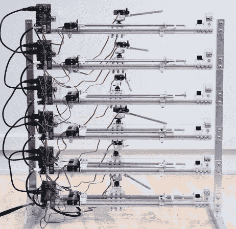

# 等等，那是电吉他？

> 原文：<https://hackaday.com/2014/06/28/wait-thats-an-electric-guitar/>

你在上面看到的是[一把六弦机电滑吉他](http://blog.jimwmurphy.com/swivel-2/)，其中每根弦和相关的伺服系统都被分配了自己的 MIDI 通道。

这是一个[吉姆·墨菲]已经工作了一段时间的项目，从技术上讲，这是第二次迭代——他称之为 Swivel 2。最初的旋转更多的是一个概念的证明，使用庞大的步进电机和螺线管——在这一个中，他升级到爱好风格的伺服系统，每串使用四个。一个用来改变音高，一个用来夹住音高移位器，两个用来拨动和抑制琴弦。

他利用配备 Arduino bootloader 的 ATMEGA328 亲自设计了 PCB 控制板，atmega 328 从计算机接收 MIDI 信号，并相应地移动伺服系统，以产生他一直使用 Ableton Live 编写模式的音频信号。

整个装置采用 3D CAD 设计，完全模块化。他甚至自己制作了吉他拾音器，使用 3D 打印的线轴，并用铜漆包线手工缠绕线圈。休息过后，请倾听它的实际表现。

[https://player.vimeo.com/video/87369403](https://player.vimeo.com/video/87369403)

他主要希望用这个为他的各种项目创造新的音效——如果它看起来有点熟悉，那是因为[Jim]在几年前我们报道过的最初的 [MechBass](http://hackaday.com/2012/11/22/mechbass-a-robotic-bass-guitar-that-sounds-fantastic/) 上工作过！