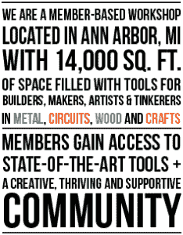

# 基于 LinuxCNC 的等离子切割路由器

> 原文：<https://hackaday.com/2014/06/27/linuxcnc-based-plasma-cutter-router/>

如果木材数控路由器只是不满足你，你会需要一些更强大的。相对而言，下一个最实惠的产品是数控等离子切割机。 *Mhmm…血浆…*

安阿伯的[制造者工厂]决定是时候给他们已经令人印象深刻的机械车间增加一些严肃的金属加工能力了。该设计是基于[JoesCNC]的，但是他们选择了一些非常结实的伺服电机，而不是步进电机。

框架由 8020 铝型材制成，这无疑增加了成本，但却是一台非常专业的机器。x 和 Y 轴'利用 NEMA 34 伺服电机，由花岗岩设备 VSD-E 伺服驱动器驱动。Z 轴使用带有 Gecko 320X 驱动器的 NEMA 23。为了进一步增加这些家伙的动力，X 和 y 上都使用了 10:1 的减速齿轮箱。

总的来说，这个项目花费了大约 8，000 美元，尽管在吸取了教训之后，他们认为他们可以花大约 6，000 美元重做它。

当他们第一次开始测试时，他们对等离子切割机产生的细小灰尘导致房间变得如此脏感到沮丧，所以他们升级到了水托盘床(2 英寸深)，这非常有帮助。事实上，零件甚至不需要完全浸没在水中，就可以减少几乎所有的灰尘。水也有助于防止损坏下面的铝床。

实际的等离子切割头只是一个 Hypertherm PowerMax 45 安培手持式等离子切割机。一位朋友慷慨地捐赠了一个定制支架，配有调整装置和内置限位开关，可以安装在机器上。

让我们来看看一些结果——干得好，伙计们！

[https://www.youtube.com/embed/zr-_xEpXBnQ?version=3&rel=1&showsearch=0&showinfo=1&iv_load_policy=1&fs=1&hl=en-US&autohide=2&wmode=transparent](https://www.youtube.com/embed/zr-_xEpXBnQ?version=3&rel=1&showsearch=0&showinfo=1&iv_load_policy=1&fs=1&hl=en-US&autohide=2&wmode=transparent)

[https://www.youtube.com/embed/YCJr9Q_xIhk?version=3&rel=1&showsearch=0&showinfo=1&iv_load_policy=1&fs=1&hl=en-US&autohide=2&wmode=transparent](https://www.youtube.com/embed/YCJr9Q_xIhk?version=3&rel=1&showsearch=0&showinfo=1&iv_load_policy=1&fs=1&hl=en-US&autohide=2&wmode=transparent)

【谢谢史蒂文！]