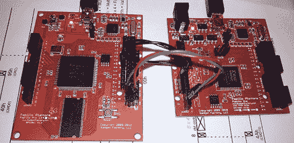

# 用 FPGA 计数非常非常快

> 原文：<https://hackaday.com/2014/06/29/counting-really-really-fast-with-an-fpga/>

在[Michael]的一次论坛潜伏会议中，他看到了一个关于 CPLD 频率计数的讨论。他想知道他是否能在 FPGA 上做同样的事情，以及计算高时钟频率会有多难。[事实证明，用一个简单的解决方案是很难的。稍微聪明一点就能让这项任务变得轻而易举，低端 FPGA 能够计数超过 500 MHz 的时钟。](http://hamsterworks.co.nz/mediawiki/index.php/High_Speed_Frequency_Counter)

计算时钟最简单的方法是用一个巨大的 30 位计数器来计算一秒钟。这是一个可怕的想法:长计数器有很多传播延迟。此外，任何采样都必须以至少两倍于输入信号的速度运行——如果您正在计算非常快的时钟，这不是一个好主意。

解决方案是让输入信号驱动一个非常小的计数器(只有 5 位),并使用 FPGA 上较慢的时钟对计数器进行采样。[迈克尔]使用了一个 5 位的格雷码，解决了普通二进制计数器从“11111”翻转到“00000”的问题。

因为[Michael]使用 5 位时钟，31 个边沿以 32 MHz 采样，所以理论上他可以采样 992 MHz 的时钟。他的 Papilio Pro 板上的 Spartan 6 根本不可能测量到这一点，但他能够测量 500 MHz 的时钟，如果没有他聪明的代码，这是不可能的。