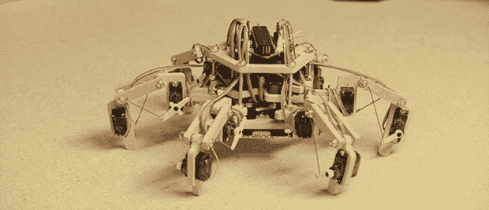

# 短粗，可爱又容易建造的六足动物

> 原文：<https://hackaday.com/2014/06/30/stubby-the-adorable-and-easy-to-build-hexapod/>

不久前，我们在 Hackaday.io 上举办了一场科幻竞赛。受 SG-1 星际之门的复制者的启发，[大家伙]和其他一些人决定远程控制的六足机器人将是一个伟大的建筑。竞赛早已结束，但这并不意味着开发停止了。现在，受复制者启发的六足机器人已经完成[，它看起来棒极了](http://hackaday.io/project/770)。

前两个版本的伺服系统动力不足，机械结构复杂。第三次是魅力，第三个版本是一个轻型机器人，具有非常简单的机械装置，能够沿着 XYZ 轴平移和旋转。包括电池在内，Stubby 仅重约 600 克，因此它的敏捷程度也令人惊讶。

六足机器人的框架被设计成可以用线锯切割，这让没有数控机床的人非常懊恼。每条腿上有三个 9g 伺服系统，都由一个定制板控制，该板具有 ATMega1284p 和一个旧 Playstation 控制器的 XBee 接口。

下面是 Stubby 的视频，当然所有的源代码和文件都可以在项目网站上找到[。](http://hackaday.io/project/770)

[https://www.youtube.com/embed/bIjOvqGbMKA?version=3&rel=1&showsearch=0&showinfo=1&iv_load_policy=1&fs=1&hl=en-US&autohide=2&wmode=transparent](https://www.youtube.com/embed/bIjOvqGbMKA?version=3&rel=1&showsearch=0&showinfo=1&iv_load_policy=1&fs=1&hl=en-US&autohide=2&wmode=transparent)