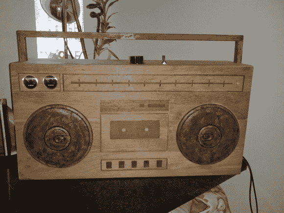
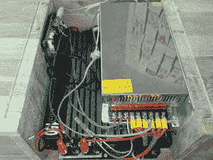

# 木制贫民窟利用回收部件

> 原文：<https://hackaday.com/2014/06/30/wooden-ghettoblaster-makes-use-of-recycled-parts/>

人类产生大量废物。看到网上有这么多旧物品被重新利用，多少让人松了一口气。我们喜欢在 Hackaday 上报道这类项目。[Martin]喜欢在他的项目中使用可回收物品，并写信告诉我们他最近完成的木制贫民窟,它利用了他到处扔的一堆旧零件和小玩意儿。

信不信由你，主机箱是用剩余的木地板建造的。假的磁带走带机构、按钮和调音器可能看起来像是被烧焦/蚀刻/染色，但它们实际上是镶嵌的深色木头。一旦所有的镶嵌物安装在橱柜的正面，整个表面被打磨光滑，边缘被倒角以增加一些视觉吸引力。

用于一对旧的售后汽车扬声器的孔不仅被切割到机箱的正面，它们还被扩孔，以便扬声器与面板齐平。[Martin]决定为项目购买一个组件，一套 VU 流量计。它们通过自己嵌入的木块安装在外壳上，并与信号路径的线路电平部分并联。

一个旧的(准确地说是 22 年前的)汽车放大器提供驱动扬声器的能量。该放大器由交流到 12v 直流电源供电，因此，不幸的是，这种设置是不可移动的，必须插在墙上。有两种方法可以让声音在这款音箱上播放，直接用 3.5 毫米耳机线插入或使用安装在音箱内的蓝牙音频接收器[Martin]。