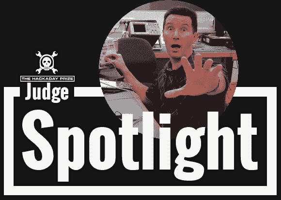

# 聚光灯法官:达夫·琼斯

> 原文：<https://hackaday.com/2014/07/01/judge-spotlight-dave-jones/>

本周的“法官聚焦”节目以[达夫·琼斯]为主角，他发布了一段视频回应我们的一系列问题。如果你在这里呆过很长时间，你可能对[戴夫]相当了解。他是 T2 电子博客 T3 的幕后人，也是 T4 Amp Hour T5 播客和 Chris Gammell 的主持人。

向[戴夫]请教一下很好。在他的职业生涯中，他经历了很多，从求职者、雇主、面试者等角度对专业工程有着深刻的见解。他在 EEVblog 和 Amp Hour 的经历加深了他对各种设备内部的了解，在众筹中的冒险，以及与众多硬件初创公司的互动。在跳转之后，查看他的视频，以及带有时间戳的问题列表。

我们相信你现在已经知道了，他正在评判[hack aday 奖](http://hackaday.io/prize)，该奖将授予你一次太空之旅和数百个其他奖项，奖励你展示使用开放式设计制造的联网设备。

[https://www.youtube.com/embed/-xX2kK-RmQU?version=3&rel=1&showsearch=0&showinfo=1&iv_load_policy=1&fs=1&hl=en-US&autohide=2&wmode=transparent](https://www.youtube.com/embed/-xX2kK-RmQU?version=3&rel=1&showsearch=0&showinfo=1&iv_load_policy=1&fs=1&hl=en-US&autohide=2&wmode=transparent)

以下是一些问题:

1.  **0:32**–据我们了解，当你开始创建 EEVblog 时，你有一份全职的工程工作。你是如何在这个时候开始这个节目的？
2.  你通常会给工程师们一个很好的建议:每次面试都带着你自己设计的东西。你建议从事与你想要的工作类型相关的工作，以作为这些面试的展示品，或者可以是任何东西？
3.  **3:30**——我们已经开始听说小公司的课外黑客活动；有点像迷你黑客空间，员工可以在那里建立有趣的东西。你对此怎么看，你愿意看到它成为一种更广泛的实践吗？
4.  **5:45**–你提到过你不太可能加入黑客空间，因为你有一个强大的家庭实验室。但是很明显你确实通过你的论坛和其他人合作。你认为这是一种虚拟黑客空间吗？你对人们如何与他人联系以进行合作或只是交流想法有什么建议吗？
5.  **7:59**–你以高度活跃而闻名——你对电子产品的兴奋具有传染性！这是一个在拍摄时经常出现的角色，还是你在日常生活中也有这种激情？
6.  **10:12**–告诉我们你与工程无关的爱好。
7.  **12:16**–你的生活中还发生了什么？
8.  **13:18**–为什么开源对你很重要？作为一名工程师，有哪些关于开源阻碍你进步的故事？有哪些开源帮助你进步成为工程师的故事？
9.  **17:16**——什么样的项目真的能勾起你的幻想，让你高兴得尖叫？