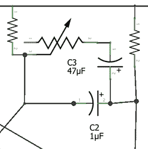

# 无故障 LED 闪光灯

> 原文：<https://hackaday.com/2014/06/30/deadbugged-led-strobe/>

 [Steel 9]正在四处寻找 LED 频闪灯，原因不明。他找不到任何他喜欢的，当这种情况发生时，他做了任何正常人都会做的事情——自己做一个。

[钢]基于这个围绕港口货运 27 LED 手电筒建设。这个手电筒就是这样——一个简单的开关，一个按钮，甚至没有一个限流电阻。毫无疑问，这是工程上的一个杰作，

增加的电路仅由一对晶体管、几个电阻、一个电容和一个电位计组成。是的，对于一个 555 芯片来说，[钢]太酷了，它只是一个简单的多谐振荡器电路，没有一个元件值是非常敏感的。

[钢]得到了他想要的，甚至没有打破面包板。因为他刚刚堵住了所有的电路，所以他也重复使用了手电筒的塑料外壳。这在任何一本书里都是胜利。