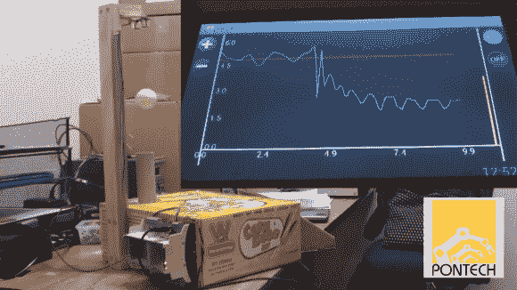

# 古老的乒乓球悬浮技巧

> 原文：<https://hackaday.com/2014/07/02/the-old-ping-pong-ball-levitation-trick/>

[雅各布]用他的[乒乓球悬浮机在悬浮球技巧上做了一点新的改变。](http://quick240.com/quicki/demos:pingponglev)我们以前都见过[磁悬浮](http://hackaday.com/2013/12/01/levitating-wireless-led-ring/)系统。在 Hackaday 这里，[Caleb]建造了一把[传送门枪，让一个同伴立方体悬浮起来。](http://hackaday.com/2012/10/11/hackadays-portal-gun-actually-levitates-a-companion-cube/)雅各布没有走磁力路线，而是将一个乒乓球悬浮在气垫上。

现在，在这里作弊是可能的，任何看过伯努利原理演示的人都知道球在气流中会保持稳定。[Jacob]通过悬浮不同重量的乒乓球来证明他的系统确实在工作。

视差平式超声波传感器测量钻机顶部和悬浮球之间的距离。如果球超过了设定的距离，[雅各布的]基于芯片套件的处理器会降低他的风扇。如果球飞得太低，风扇就会加大油门。基于软件的比例积分微分(PID)回路使系统处于控制之下。通过 USB 连接到控制器的 Android 平板电脑上显示了球距离与风扇速度的关系图。

当[Jacob]将一个重球换成一个轻球时，轻球会被推到预先设定的高度之外。控制器通过降低风扇速度做出响应，球回落。谁说一盒玉米热狗做不了什么好事？

[https://www.youtube.com/embed/2IdhJw5HJgQ?version=3&rel=1&showsearch=0&showinfo=1&iv_load_policy=1&fs=1&hl=en-US&autohide=2&wmode=transparent](https://www.youtube.com/embed/2IdhJw5HJgQ?version=3&rel=1&showsearch=0&showinfo=1&iv_load_policy=1&fs=1&hl=en-US&autohide=2&wmode=transparent)