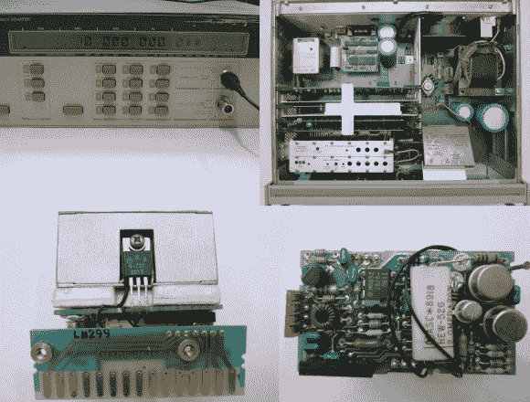

# XOXO 代表 OCXO

> 原文：<https://hackaday.com/2014/07/03/xoxo-for-the-ocxo/>

[黄嘉丽]最近[给自己买了一个频率计数器](http://www.kerrywong.com/2014/06/29/hp-5350b-microwave-counter-teardown/)。不是随便一个柜台，一个经典的惠普 5350B 微波计数器。这个宝贝将从 10Hz 一直到 20GHz，只有一个输入转换。作为 Hackaday 奖评委[ [达夫·琼斯](http://hackaday.com/2014/07/01/judge-spotlight-dave-jones/) ]的忠实粉丝，[凯瑞]没有打开它，他把它拆开了。在这个过程中，他给了我们一些 80 年代后期的老式惠普铁伟大的照片。

一切似乎都处于相对良好的工作状态，除了烤箱指示灯，它从来没有关闭。5350B 有三个可用的时基:一个热补偿晶体振荡器(TCXO)，一个[恒温晶体振荡器](http://en.wikipedia.org/wiki/Crystal_oven) (OCXO)，以及一个高稳定性的 OCXO。[凯瑞的] 5350B 有选项 001，OCXO。考虑到它只是 5350B 的 5500 美元基础价格的 750 美元升级，许多 5350B 在野外有这个选项就不足为奇了。

[Kerry]检查了他的 5350B 的瓦数，确定它在通电时输出了大约 27 瓦，并保持在这个功率。如果 OCXO 在工作，大约 10 分钟后当烤箱达到温度时，功率就会下降。是时候打开烤箱了！

拿着惠普网站上的一份 5350B 维修手册，[Kerry]打开了他的 OCXO。用作加热器的达林顿晶体管很好。控制电路没问题。问题原来是一个简单的热保险丝。维修手册建议跳出保险丝进行测试。保险丝一跳，烤箱就启动了。又一件经典的(仍然非常有用的)测试设备全面恢复运行。

[via [危险原型](http://dangerousprototypes.com/2014/07/02/hp-5350b-ocxo-repair/)