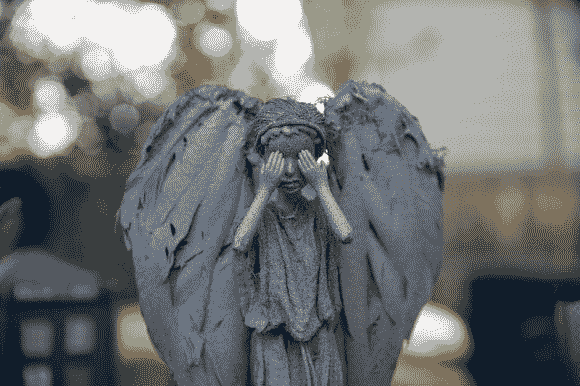

# 不要眨眼，肯…否则哭泣的芭比会抓住你

> 原文：<https://hackaday.com/2014/07/03/dont-blink-ken-or-the-weeping-barbie-will-get-you/>

That which holds the image of an Angel becomes itself an Angel. Have fun with that.

芭比娃娃自 1959 年就出现了，但从未如此恐怖过。[人类 wog]决定将一些可怜的、毫无防备的芭比娃娃改造成哭泣的天使，从而将令人毛骨悚然的因素提升一个档次。

如果你不熟悉哭泣天使的概念，你可能不会看《神秘博士》。《哭泣的天使》这一集名为“[眨眼](http://en.wikipedia.org/wiki/Blink_(Doctor_Who) "Blink")”，现在被认为是《神秘博士》的经典剧集。基本前提是，一些令人毛骨悚然、哭泣的石像只有在没人看的时候才能移动。甚至闭上眼睛眨一会儿也足以让它们动起来。其实挺恐怖的，但也很牛逼。

【anthropolywog】从购买几个普通的芭比娃娃开始。然后她砍掉了肘部所有的手臂。这是因为芭比娃娃的手臂通常不会在肘部弯曲，这是获得经典的哭泣天使姿势所必需的。头发被粘成一个发髻，类似于节目中哭泣的天使。然后，这些芭比娃娃被热粘在木制支架上，以便于制作。

起皱的棉布然后被裁剪成简单的服装形状，盖在洋娃娃身上。然后整个娃娃被喷上埃尔默胶水和水的混合物。这会使布料变得坚硬，让整体看起来更有雕塑感。

最复杂的部分是翅膀。用纸板和工艺羽毛手工制作翅膀。这个过程花了几个小时的工作，以获得一些看起来是正确的。

这些娃娃与翅膀分开涂油漆。然后装上翅膀，整个娃娃都涂上了“天然石”质感的喷漆。最后的润色是用一个精细的永久性记号笔重新画出褪色的眼睛和嘴巴。你可以在照片上看到，结果非常好。

[via [Reddit](http://www.reddit.com/r/howto/comments/29or48/how_to_turn_barbies_into_doctor_who_weeping_angels/ "Reddit.com")