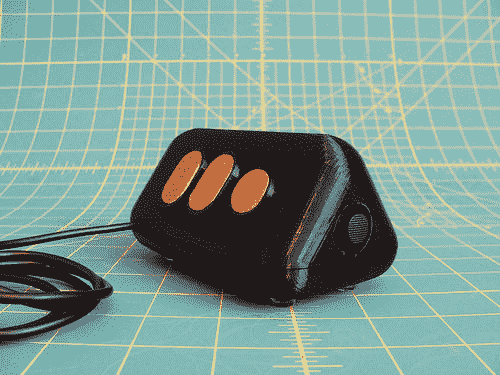

# 兔子 H1 是固定鼠标的替代品

> 原文：<https://hackaday.com/2014/07/04/the-rabbit-h1-is-a-stationary-mouse-replacement/>

[戴夫]有一些大计划，要为自己造一台 1980 年代风格的电脑。大多数情况下，大型项目可以通过将其分解成更小的组件而变得更容易。[戴夫]决定开始他的项目，为他未来的电脑设计和建造一个定制控制器。他称之为兔子 H1。

[戴夫]的灵感来自于航空业常用的 [HOTAS](http://en.wikipedia.org/wiki/HOTAS "HOTAS") 油门控制系统。HOTAS 背后的基本想法是，飞行员有一堆控制内置在油门杆。这样，飞行员就不必把手从油门上拿开。[戴夫]带着这个基本的概念，并运行它。

他首先在 [OpenSCAD](http://www.hackaday.com/2011/06/03/onshoulderstv-knows-how-to-use-openscad/ "OpenSCAD") 中设计了一个简单的控制器形状，并在他的 3D 打印机上打印出来。他用手测试了一下，发现感觉不太对劲。第二次尝试在顶部更窄，结果是一个三角形。[戴夫]然后找到手指最舒适的位置，用记号笔在曲子上做标记。最后，他测量出所有的标记，并将它们转移到 OpenSCAD 中，以完善他的设计。

[Dave]对 OpenSCAD 很感兴趣，为所有按钮设计了各种铰链和胶合板镶嵌物。幸运的是，3D 打印机软件和 CNC 路由器软件都接受 STL 文件。这意味着他能够在一个程序中同时设计两个部分，并使用两台机器的输出。

随着物理控制器的消失，是时候在电子设备上工作了。[Dave]从 Adafruit 买了几个操纵杆和几个按钮。其中一个操纵杆控制鼠标光标。另一个操纵杆控制垂直和水平滚动，并包括一个左击按钮。这两个按钮分别用于点击鼠标中键和右键。所有这些输入都由一个小小的 Arduino 读取。Teensy 很小巧，很容易模仿 USB 鼠标，这使得它非常适合这项工作。

[戴夫]已经在[Thingiverse](http://www.thingiverse.com/thing:363859 "Thingiverse")上发表了他的设计，如果你想试着自己做一个的话。