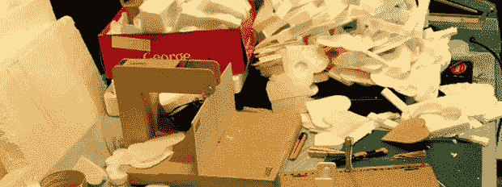

# 成堆的泡沫与热线切片机

> 原文：<https://hackaday.com/2014/07/06/piles-of-foam-with-a-hot-wire-slicer/>

你可以用泡沫做一百万件事情，从一些非常令人印象深刻的遥控飞机，一直到全尺寸的飞机，你可以飞到那边的蓝色天空中。切割泡沫，虽然，这是一个问题，你最好的选择通常是一个热线泡沫切割机。[【Darcy】提出了一些非常好的弓形切刀的计划](http://inventorartist.com/in-love-with-foam/)，但也有一些泡沫切片机的实验——一种热丝机器，它取出泡沫部分，像熏制火腿一样切片。

这种弓型切割机的特点是激光切割部件、一对 1/4-20 螺栓、一个电源和大约一英尺的镍铬合金线。这是切割泡沫的最低限度，但它似乎真的非常非常好。

热线泡沫切片机是一个有趣得多的装置，能够用泡沫制作多个薄片。基本上，它是一个激光切割托盘，沿侧面有一个螺栓孔图案。沿着侧面放两个螺栓，在螺纹上绕一些镍铬合金线，你就有办法切割厚度约为 1/20 英寸的泡沫。如果你想用非常薄的泡沫蒙住一个模型，或者你找不到适合你项目的泡沫厚度，这是很好的选择。