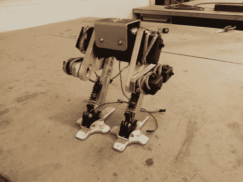

# 哨兵项目——一个两足行走机器人

> 原文：<https://hackaday.com/2014/07/06/project-sentinel-a-bipedal-walking-robot/>

[叶冠]一直对步行机器人很着迷——所以他决定自己造一个。它被称为[哨兵项目](http://yaleguan.com/project-sentinel.html)，他松散地基于战锤 40K 中的哨兵步行器和《星球大战》中的两条腿 AT-AT 步行器的设计。

这两个机器人都是基于鸟的行走方式。科学上这被称为 digitgrade 行走方式，这意味着它们用脚趾站立和行走——这通常使它们比大多数其他动物移动得更快更安静。

[叶]已经成功地为他的项目实现了这一点，使用了 8 个伺服电机，平衡了脚正上方的质心。把它想象成一个倒立摆，它由伺服力矩支撑，由陀螺仪平衡。他计划通过传感器反馈让它完全自主。

虽然还没有完成，但他已经发布了所有的 [CAD 文件](http://yaleguan.com/project-sentinel-cad-files.html)和[一个很好的构建日志](http://yaleguan.com/sentinel-project-forum.html)供任何人自己尝试——我们很期待看到最终产品。休息后看看它在原地行走吧！

[https://www.youtube.com/embed/UR09mLrv2mo?version=3&rel=1&showsearch=0&showinfo=1&iv_load_policy=1&fs=1&hl=en-US&autohide=2&wmode=transparent](https://www.youtube.com/embed/UR09mLrv2mo?version=3&rel=1&showsearch=0&showinfo=1&iv_load_policy=1&fs=1&hl=en-US&autohide=2&wmode=transparent)

[via [HackedGadgets](http://hackedgadgets.com/2014/06/24/bipedal-walking-sentinel-project/)