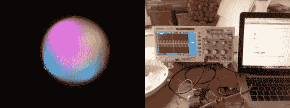

# 基本的宜家壁灯变得灵动多彩！

> 原文：<https://hackaday.com/2014/07/08/basic-ikea-wall-light-turned-smart-and-colorful/>

[Daniel grie Haber]刚刚完成了他最新的电子项目，我们非常喜欢。他拿了一个便宜的宜家壁灯/吸顶灯，用 RGB LEDs 和智能控制彻底改造了它！

他使用的光叫做[锁](http://www.ikea.com/de/de/catalog/products/00055691/)，仅仅是 1.79 €或者大约 4 美元。它有很大的内部空间和一个漂亮的磨砂玻璃盘，可以产生很好的色彩扩散。他设计了一个漂亮的大圆形印刷电路板，安装在原来的安装点内。为了做到这一点，他使用 Eagle 软件创建电路，并使用他可信赖的台式计算机数控系统加工出图案。

为了控制灯光，他使用了一个放在身边的旧 ATMega8 板，带有 Arduino IDE 和 WS2812 库。他概述了你在 GitHub 上制作自己的作品所需的所有部分、图表和程序草图。

不幸的是，发光二极管没有他希望的那么亮，所以它不能用来取代普通的房间灯——相反，他计划将这个项目变成一个卧室的日出定时灯——仍然非常酷！