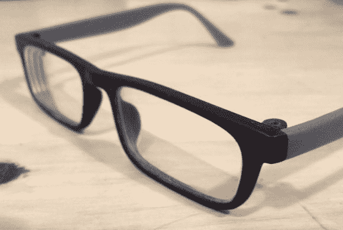

# 打破你的框架？打印一些新的！

> 原文：<https://hackaday.com/2014/07/08/break-your-frames-print-some-new-ones/>

当[亚伦·波特菲尔德]不小心打破了他的眼镜框时，他认为这是一个机会，而不是一个不幸的事件。他决定[设计并打印新的](http://www.instructables.com/id/How-to-design-3d-printed-glasses/)来配合他的处方镜片！

承担这样一个项目最棘手的部分是围绕现有的镜片设计眼镜，因为通常情况下，镜片被切割成适合框架——而不是相反。这就是我们对这个项目印象特别深刻的原因。[Aaron]能够使用他的照相手机和 Autodesk 的 123D Catch 软件(免费)对镜头进行 3D 扫描，以创建镜头模型！一旦他有了透镜的轮廓，他就用卡尺测量它的最大尺寸来适当地缩放它。

现在这是有点棘手的地方——设计框架。[Aaron]正在使用 Rhino 进行设计工作，他实际上为任何想要尝试这种东西的人制定了非常好的步骤。他详细描述了匹配镜片的曲率，设计镜片周围的框架，当然，实际上是将镜片安装到位。

整个项目有一个小小的警告——帧是在一台漂亮的 Stratasys polyjet 3D 打印机上打印的——由于几何形状，在传统的业余爱好 FDM 机器上打印可能有点棘手(或不可能)。不管怎样——自己做眼镜是一种严肃的极客行为。干得好[Aaron]！