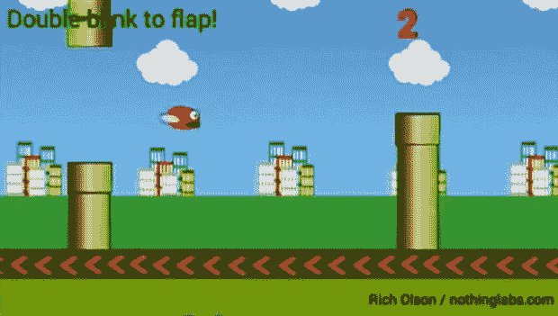

# 分心的未来，就在你面前

> 原文：<https://hackaday.com/2014/07/09/the-future-of-distraction-right-in-front-of-your-face/>

假设你要去见一个新的人，他们不像不是出生在谷仓的正常人那样交流，而是一直玩手机。一个收银员或销售人员如此令人难以忍受地被 Facebooks 分心，你会猜测他们在某个开发人员的 QA 部门兼职？所有这些事情都将很快成为遥远而可怕的记忆，因为现在你可以在谷歌眼镜上玩 Flappy Bird。

[Rich]拥有他的眼镜已经有一段时间了，并打算为它编写一个应用程序。这需要一点灵感，但当使用眼睛传感器来控制每个人最喜欢的 8 位鸟的想法时，一切都水到渠成了。这最终成为了玻璃的一个有趣的用途，事实上我们并不介意尝试一下。

这只鸟是由一双眨眼控制的。在下面的视频中，你可以看到可能会有一点延迟，这取决于[Rich]如何将视频组合在一起。最好抓住那个。APK，趁还有时间。[Rich]说任何已经为谷歌眼镜支付过高价格的人都可以免费下载。

[https://www.youtube.com/embed/pI4TJcTguAs?version=3&rel=1&showsearch=0&showinfo=1&iv_load_policy=1&fs=1&hl=en-US&autohide=2&wmode=transparent](https://www.youtube.com/embed/pI4TJcTguAs?version=3&rel=1&showsearch=0&showinfo=1&iv_load_policy=1&fs=1&hl=en-US&autohide=2&wmode=transparent)