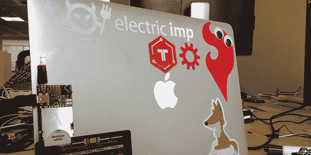

# 电动 Imp 和简单的 Hackaday 奖品入口

> 原文：<https://hackaday.com/2014/07/10/the-electric-imp-and-an-easy-hackaday-prize-entry/>

距离 Hackaday 奖的第一个截止日期还有不到一个月的时间，有几个问题我们已经反复回答过了:“关联”是什么意思还有，‘我真的有足够的时间为黑客日奖做点什么吗？’幸运的是，Electric Imp 的[Matt]制作了一个非常短的 THP 参赛作品的演示。这是一种“黑客”灯，有点像电视或广播演播室里的“广播”灯。

这个项目[的想法来自一条发给【Matt】](https://twitter.com/Matsubue/statuses/486307382796902400)的推文，看起来实现起来很简单。在抓到一个小鬼和[一个分线板](https://www.sparkfun.com/products/11400)后，一个 LED、按钮和电阻被连接起来，通过 USB 供电。该设备的代码非常简单，Imp 可以轻松地使“黑客”按钮发出 tweet 并提供一个简单的网页。

[Matt]在一个下午完成了这个项目，虽然它不像 3D 打印机、CNC 机器和也参加 Hackaday 奖的 tricorders 那样复杂，但它满足了我们正在寻找的所有要求。

当然，“连接”是一个非常宽泛的术语，即使你有一个与 led、串行连接、[甚至鸽子](http://hackaday.io/project/1085-Pigeon-Post)通信的项目，勾选“连接”复选框就足够了。

离黑客日大奖的第一个截止日期还有几个星期，[所以赶快行动吧](http://hackaday.io/prize)。

[via [大胡子发明家](http://beardedinventor.com/2014/07/08/Hackaday-Prize/)