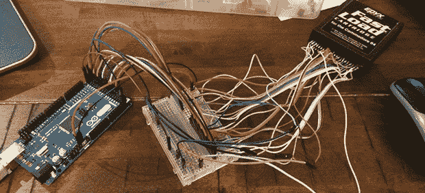

# 一个简单的 Commodore 64 手推车翻斗车

> 原文：<https://hackaday.com/2014/07/09/a-simple-commodore-64-cart-dumper/>

一天，当[Rob]在他的车库里挖掘时，他发现了一个旧的 Commodore 64 弹药筒。由于在网上找不到 ROM，他开始想知道这个古老的设备里存储了什么。偷看一下储存在这个墨盒中的比特需要将整个东西转储到一台现代计算机上，用 Arduino 武装起来，[他创造了一个简单的 cart dumper](https://github.com/segrax/Arduino-C64-Cartridge-Dumper) ，能够读取标准的 8k 墨盒而不出问题。

C64 的[扩展端口有许多与这些旧计算机内部的控制逻辑相对应的引脚，但【Rob】真正感兴趣的只有 8 条数据线和 16 条地址线。通过一小段代码，[Rob]得到了一个 Arduino Mega 来遍历所有的地址引脚，并读取内存中该位置的相应数据。这些数据然后通过 USB 发送到一个 C 应用程序，该应用程序以十六进制和文本格式转储所有内容。](http://www.c64-wiki.com/index.php/Expansion_Port)

虽然几乎每个 C64 游戏的光盘都可以在网上找到，但[Rob]很不幸地找到了一个没有的。不过，这并不重要，因为我们不知道[Rob]是否有使这个手推车有用的 1541 磁盘驱动器。尽管如此，它还是很好地提醒了人们，当 Arduino 被用作电子瑞士军刀时，它是多么有用。