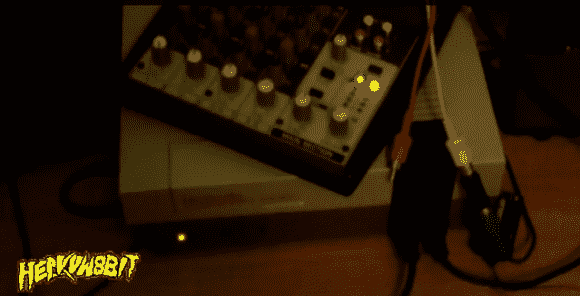

# Commodore 64 和任天堂与 SYNCART 一起制作美妙的音乐

> 原文：<https://hackaday.com/2014/07/12/commodore-64-and-nintendo-make-beautiful-music-together-with-syncart/>

[丹]一直在努力开发[cyn cart](http://heavyw8bit.com/cyncart.php "CYNCART")让他的准将 64 和原来的 NES 一起玩。我们已经在《T3》之前看过[丹]的作品[，很明显他对他的芯片音乐是认真的。](http://hackaday.com/2013/10/18/keyboard-spoofs-4-nes-controllers-for-chiptune-goodness/ "NES Chiptunes")

这个项目从一个叫做 [Cynthcart](http://atariage.com/store/index.php?l=product_detail&p=322 "Cynthcart") 的东西开始。Cynthcart 是一个 Commodore 64 墨盒，允许您直接控制计算机的 SID 芯片。实际上，它把你的 Commodore 64 变成了合成器。[丹]意识到准将的用户端口发送简单的八位值，这恰好与 NES 的控制器端口完全匹配。理论上，他应该可以让这两个系统互相通信。

[Dan]首先修改 Cynthcart，将数据从 Commodore 上的用户端口发送出去。该数据被直接发送到第二播放器控制器端口中的 NES 4021 移位寄存器芯片。NES 运行一个程序，将这些数据转化为 NES 音频芯片上的声音。然后，第一播放器控制器可以用于修改 NES 上的一些其他声音设置。音符在准将的键盘上演奏。这种设置也可以用来同时在两个系统上播放音乐。请务必观看下面的系统运行视频。

[https://www.youtube.com/embed/_WsKdihq094?version=3&rel=1&showsearch=0&showinfo=1&iv_load_policy=1&fs=1&hl=en-US&autohide=2&wmode=transparent](https://www.youtube.com/embed/_WsKdihq094?version=3&rel=1&showsearch=0&showinfo=1&iv_load_policy=1&fs=1&hl=en-US&autohide=2&wmode=transparent)