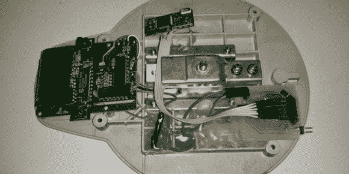

# 为您的厨房秤添加蓝牙接口

> 原文：<https://hackaday.com/2014/07/12/add-a-bluetooth-interface-to-your-kitchen-scale/>

当[亚当]发现自己需要一个测力计时，他不想为一个高端型号支付现金。相反，他意识到他应该能够修改一个简单而便宜的厨房秤来达到他想要的结果。

[Adam]拥有的厨房秤使用双面 PCB 上的所有通孔元件。他能够轻松识别所有 IC，并在线找到它们的数据手册。在用频率计数器做了一些研究和探索后，他意识到其中一个 IC 正在输出一个频率，其脉冲宽度与放在秤上的重量成正比。他知道他应该能够利用这个信号来达到自己的目的。

[Adam]创建了自己定制的表面贴装 PCB，并使用 ATMega8 来检测脉冲宽度的变化。然后他连接了一个蓝牙模块来无线传输数据。这些组件所需电压不超过 5V，但是电子秤使用两节 3V 电池。利用他手头的东西，[亚当]只用了几个二极管就能降低电压。

[Adam]设法把所有东西都塞进原来的箱子里，几乎不加修改。他现在正在考虑编写一个 Android 应用程序来与他升级后的厨房秤接口。