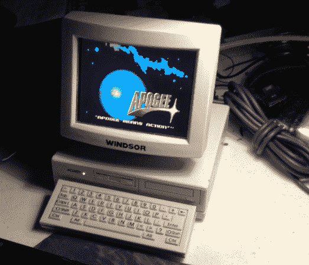

# Raspberry Pi 将一台新奇的收音机变成了一台真正的电脑

> 原文：<https://hackaday.com/2014/07/15/raspberry-pi-turns-a-novelty-radio-into-a-real-computer/>

[Strider19]还记得 90 年代，那时他有一台小巧精致的收音机。这台收音机的外形像一台电脑，是典型的调幅/调频收音机，显示器充当扬声器。他原来的收音机早就不在了，但[Strider19]在大家都喜欢的拍卖网站上找到了替代品。手里拿着替换的收音机，他开始实施他的计划:把它变成一个史诗般的覆盆子 Pi 盒子。

树莓派非常适合，但[strider 19]的 3.5 英寸复合显示器不太适合。跟随[本·赫克]的脚步，[Strider19]将 LCD 的控制 PCB 切割下来以适合外壳。一块透明的聚碳酸酯保护脆弱的液晶显示器免受手指戳伤。显示器的按钮板、两个 USB 端口和一个外部复合输入很好地安装在 CRT 后部的前电池盒内。后面甚至有足够的空间隐藏 USB WiFi 适配器。

Raspi 本身完全适合无线电的底座，以及直流到 DC 转换器、USB 集线器、实时时钟模块和一整束用于扩展连接器的电线。

最后的结果太棒了！多亏了[[strider 19]的 Reddit 线程](http://www.reddit.com/r/raspberry_pi/comments/2aki7n/1990s_novelty_computer_fm_radio_modded_into_a/)上的一个请求，我们有了[末日在(前)电台](http://i.imgur.com/nrbdQ9U.jpg)上运行的图片。即使是 Windows 3.1 也可以在 DosBox 下运行，尽管它需要一点调整来获得正确的显示设置。现在[Strider19]只需要想出如何把那个小键盘变成一个工作模型。我们认为一些老学校手机键盘黑客可能是为了！