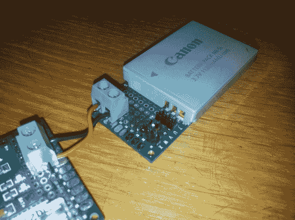

# 最后，一个易于制造的锂离子电池支架

> 原文：<https://hackaday.com/2014/07/16/finally-an-easy-to-make-holder-for-lithium-ion-batteries/>

对于需要更多电力的项目来说，大规模生产那些用于手机、相机和其他电子产品的小型矩形锂离子电池非常有用——问题是，除了将端子焊接到位之外，如何安装它们？当然是带着一点儿[冲浪板！](http://ripitapart.wordpress.com/2014/06/17/a-temporary-hold-creating-li-ion-battery-holders-with-prototype-boards-and-pin-headers/)

[Jason]当他试图为他的另一个项目找到一种为电池电量计安装小型锂电池的方法时，产生了这个想法。他发现，如果使用高质量的 perfboard，可以使用 90 度公引脚接头来接触端子，并在另一端使用一条母引脚接头作为一种电池挡块。这使你可以非常舒适地将电池挤压到位——你可能需要调整公引脚的长度，以便微调配合！

现在你可以添加一个漂亮的电线终端，焊接连接，你有它，一个容易制造，非常有用的电池座！