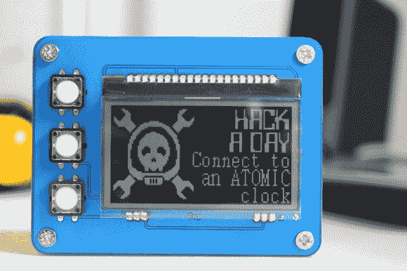

# THP 入口:原子时空

> 原文：<https://hackaday.com/2014/07/18/thp-entry-atomic-space-time/>

准确的时间就在我们身边。UTC 时间信息从数千英里外的太空卫星上传下来，触手可及。你只需要知道如何伸出手去抓住它。[hkdcsf]不仅知道如何做到这一点，他还以 的风格做到了 *[。](http://hackaday.io/project/1353)*

向黑客日奖大赛致敬，[hkdcsf]的原子钟制作精良。它不仅能从 GPS 卫星获得时间信息，还能从 [DCF77 发射机](http://en.wikipedia.org/wiki/DCF77)获取信息。如果它处于两个信号都找不到的位置，RTC 晶体会保持时间和日期准确。

他的设计基于 PIC18F25K20，其中包含如此多的功能，可能会让你眼花缭乱。所以要注意——在看这个项目之前，你可能想坐在座位上。[hkdcsf]在详细描述他的时钟如何工作方面做得很好，他提供这种细节水平的努力肯定会帮助其他黑客在他们未来的项目中添加类似的功能。

* * *

 **本帖介绍的项目是[黑客大奖](http://hackaday.io/prize)中的一个参赛项目。建造一些令人敬畏的东西，赢得太空之旅或数百个其他奖品。**

[https://www.youtube.com/embed/kOOB87AEKC8?version=3&rel=1&showsearch=0&showinfo=1&iv_load_policy=1&fs=1&hl=en-US&autohide=2&wmode=transparent](https://www.youtube.com/embed/kOOB87AEKC8?version=3&rel=1&showsearch=0&showinfo=1&iv_load_policy=1&fs=1&hl=en-US&autohide=2&wmode=transparent)