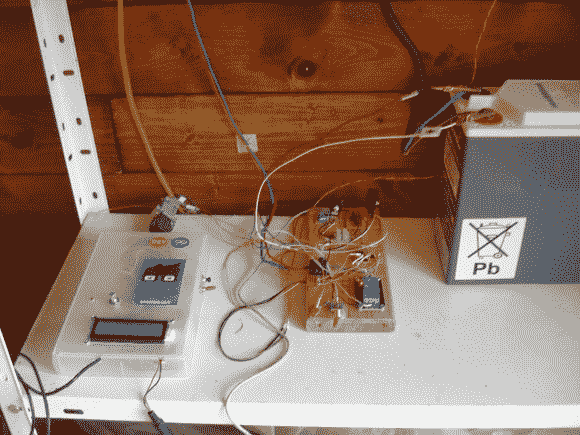

# 太阳能 DIY 植物浇水系统

> 原文：<https://hackaday.com/2014/07/16/solar-powered-diy-plant-watering-system/>

在离厨房几步之遥的地方有新鲜的蔬菜是很棒的，但是保持这些植物健康需要努力。[Pierre]度假回来后，发现他的番茄植株枯萎了，才艰难地发现了这一点。他决定通过建造自己的太阳能植物浇水系统来解决这个问题。

Arduino 充当系统的大脑。它被编程为每十分钟检查一次光敏电阻。晚上 8:30，Arduino 将根据它在一天中检测到的阳光量来决定给植物浇多少水。这使得系统能够给植物浇适量的水。浇水是通过触发一个 5V 的继电器来完成的，这个继电器会打开一个游泳池的水泵。

[Pierre]很明显他想要一个“绿色”的温室，所以他用太阳光为这个系统供电。一块 55 瓦的太阳能电池板给 12V 的铅酸电池充电。来自电池的电力被降低到 Arduino 所需的适当的 5V。现在[皮埃尔]可以从他的植物生长所用的同一种能源中为他的灌溉系统提供能量。