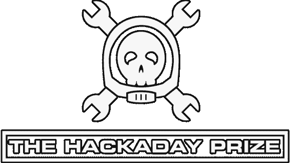

# Hackaday 奖励规则更新和参赛日期延长

> 原文：<https://hackaday.com/2014/07/18/the-hackaday-prize-rules-change-and-entry-date-extension/>

#### 黑客大赛正式规则修正案

Hackaday 一直在努力工作，以确保获得 Hackaday 奖的资格要求得到充分理解。最近[我们发布了 FAQ](http://hackaday.io/prize/faq) 来帮助回答问题，并且我们更新了[主竞赛页面](http://hackaday.io/prize)来使信息更容易找到。我们还发布了两个“演练”视频，展示满足这些要求是多么容易。鉴于这些澄清，以及这些有用资源的可用性，我们决定将参赛截止日期从 2014 年 8 月 4 日延长至 2014 年 8 月 20 日，并对正式规则中的几项要求进行了小幅修改。这里有一个总结:

*   参赛者现在必须在太平洋时间 2014 年 8 月 20 日(而不是 2014 年 8 月 4 日)11:50 之前完成“机构群体投票(第一阶段)”和“四分之一决赛(第二阶段)”的所有要求。
*   参赛者不再需要为社区投票阶段制作一个视频，为四分之一决赛阶段制作另一个视频。相反，在 2014 年 8 月 20 日的四分之一决赛截止日期下午 11 点 50 分之前，只需要一个视频，即官方规则“四分之一决赛(第二阶段)”小节中描述的视频。
*   四分之一决赛阶段不再需要建造说明。
*   参赛者不需要在比赛的任何时候向 Hackaday 的 YouTube 频道发布任何视频(尽管你仍然需要将每个视频上传到 YouTube 或优酷，并用规则中提供的关键词进行标记)。

我们已经修改了官方规则以反映这些变化。请[在此](http://hackaday.io/prize/rules-en)查看它们。

我们希望这将使你更容易进入并通过展示你疯狂的电子技能来领取 Hackaday 奖。你有额外的时间…开始黑吧！

一如既往，如果您对 Hackaday 大奖有任何疑问，可以直接联系我们:[prize@hackaday.com](mailto:prize@hackaday.com)

谢谢，祝你好运！