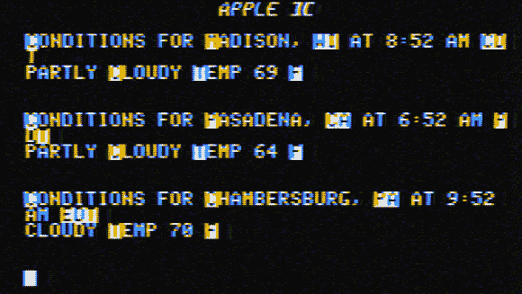
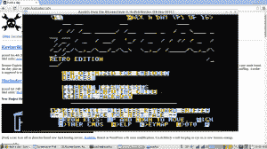

# 苹果][图形作为您的屏幕保护程序或第二屏幕

> 原文：<https://hackaday.com/2014/07/18/apple-graphics-as-your-screensaver-or-second-screen/>



潮人庆幸，你其实可以让那些高科技 IPS 面板看起来像垃圾。非常怀旧的垃圾。[Kaveen Rodrigo]写道，展示他如何将天气数据显示为他的苹果][模拟屏保。

[](http://hackaday.com/2014/07/18/apple-graphics-as-your-screensaver-or-second-screen/2014-07-08-234300_1366x768_scrot/) 他正在开发 Apple2 包，它是 Linux 系统上可用的 xscreensaver 的一部分。该程序有一个选项标志，允许您在其中运行另一个程序。这可以是任何事情，包括使用它作为您的终端模拟器。[Adrian]最近给我们发来了我们复古版的截图。他运行 bash 并加载 freenet 只是为了享受过去的美好时光。

在这种情况下，[Kaveen]使用 Python 来获取、解析和打印一个 Yahoo weather json 包。因为它只是一个在启动屏保时被调用的程序，所以你可以直接使用它，或者手动启动它，在不使用的时候填充你的第二个显示器。

我们试了一下，修改了他的代码，加入了一组邮政编码。每小时它会拉下数据并重绘屏幕。但是我们在里面放了足够的数据，你可以在几分钟内用你自己的数据替换它。如果你有，在评论里贴一张截图和你用它做什么。

下面是我们的示例代码:

```

#!/usr/bin/env python2
# -*- coding: utf-8 -*-
#
#  a2.py
#  Based on the work of Kaveen Rodrigo which can be found here:
#  http://geeknirvana.org/?p=4
#  The original carried the following license:
#  
#  Copyright 2014 Kaveen Rodrigo &lt;kaveenr@KNET&gt;
#  
#  This program is free software; you can redistribute it and/or modify
#  it under the terms of the GNU General Public License as published by
#  the Free Software Foundation; either version 2 of the License, or
#  (at your option) any later version.
#  
#  This program is distributed in the hope that it will be useful,
#  but WITHOUT ANY WARRANTY; without even the implied warranty of
#  MERCHANTABILITY or FITNESS FOR A PARTICULAR PURPOSE.  See the
#  GNU General Public License for more details.
#  
#  You should have received a copy of the GNU General Public License
#  along with this program; if not, write to the Free Software
#  Foundation, Inc., 51 Franklin Street, Fifth Floor, Boston,
#  MA 02110-1301, USA.
#  
#  

import urllib2,json,time,os

locationCodes = (53716,91105,17201)

def getIt(postalCode):
        try:
                html = urllib2.urlopen(&quot;http://query.yahooapis.com/v1/public/yql?q=select%20item%20from%20weather.forecast%20where%20location%3D%22&quot;+str(postalCode)+&quot;%22&amp;format=json&quot;).read()
                return json.loads(html)
        except:
                print(&quot;Are you on the innernet?&quot;)
                exit()

def main():
        while True:
		for code in locationCodes:
	                js = getIt(code)
	                print(js[&quot;query&quot;][&quot;results&quot;][&quot;channel&quot;][&quot;item&quot;][&quot;title&quot;])
        	        print(js[&quot;query&quot;][&quot;results&quot;][&quot;channel&quot;][&quot;item&quot;][&quot;condition&quot;][&quot;text&quot;]+&quot; Temp &quot;+js[&quot;query&quot;][&quot;results&quot;][&quot;channel&quot;][&quot;item&quot;][&quot;condition&quot;][&quot;temp&quot;]+&quot; F&quot;)
			print
			print
                time.sleep(3600)
		os.system('clear')
		print &quot;                apple ][&quot;
                print
        return 0
if __name__ == '__main__':
        main()

```