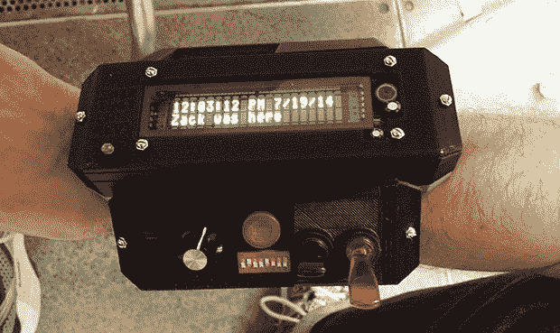

# 你的可穿戴技术是不是太微妙了？

> 原文：<https://hackaday.com/2014/07/19/wearable/>

对于任何骗局，你都会让人们带着他们创造的东西到处走。这是可穿戴技术的完美场所，HOPE X [的精华是[扎克]的智能手表](http://zackfreedman.com/2014/07/19/my-3d-printed-big-ass-smartwatch/)。宣传为 3D 打印的大屁股智能手表，它一点也不精致，有足够多的小工具和小发明，甚至让最大的技术爱好者脸红

智能手表的正面是一个真正的 2×20 玻璃封装 VFD，运行电压为 160 伏，选择它是因为它的危险性和特性。在 3D 打印的外壳内是一个 Teensy 3.0，锅，旋钮，开关，激光，led 和酒精传感器，因为“未来是量化饮酒”。

这款智能手表的应用包括 TV-B-Gone、激光笔、酒精测试仪、手电筒，以及[扎克]能想到的任何涉及蓝牙适配器和文本显示器的东西。下面是[Zack]在 HOPE 演示手表的视频。

[https://www.youtube.com/embed/wWSBTQgqbtY?version=3&rel=1&showsearch=0&showinfo=1&iv_load_policy=1&fs=1&hl=en-US&autohide=2&wmode=transparent](https://www.youtube.com/embed/wWSBTQgqbtY?version=3&rel=1&showsearch=0&showinfo=1&iv_load_policy=1&fs=1&hl=en-US&autohide=2&wmode=transparent)