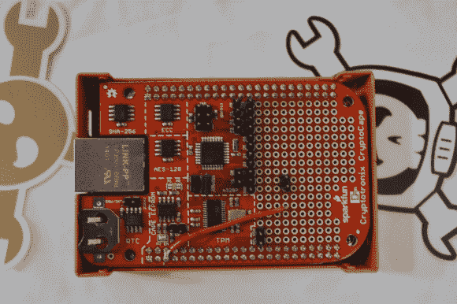

# 猎兔犬骨的隐形衣

> 原文：<https://hackaday.com/2014/07/20/the-cryptocape-for-beaglebone/>

[https://www.youtube.com/embed/DtqRc_RDSKI?version=3&rel=1&showsearch=0&showinfo=1&iv_load_policy=1&fs=1&hl=en-US&autohide=2&wmode=transparent](https://www.youtube.com/embed/DtqRc_RDSKI?version=3&rel=1&showsearch=0&showinfo=1&iv_load_policy=1&fs=1&hl=en-US&autohide=2&wmode=transparent)

[乔希·达特科]在霍普 X 附近闲逛，炫耀他的一些商品，并好心地向我们展示他的隐形衣。这是 BeagleBone 的一个插件，它将一些常见的加密硬件分解为一个易于接口的包。

CryptoCape 上有一个 Atmel [可信平台模块](http://www.atmel.com/products/security-ics/embedded/default.aspx)，一个[椭圆曲线芯片](http://www.atmel.com/products/security-ics/cryptoauthentication/ecc-256.aspx)，一个 [SHA-256 认证器](http://www.atmel.com/devices/atsha204.aspx)，一个加密的 EEPROM，一个实时时钟，以及一个 ATMega328p，用于与 Cape 上巨大的原型区域上的其他组件和模块进行接口。

[Josh]与 Sparkfun 合作建造了 CryptoCape，所以如果你没有一大堆出口限制的话，[你可以在那里挑选一个](https://www.sparkfun.com/products/12773)。下面是板子的图片。

