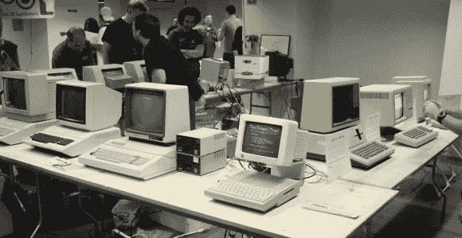

# 三月参加七月的希望 X

> 原文：<https://hackaday.com/2014/07/20/march-attends-hope-x-in-july/>

大西洋中部的复古计算爱好者( [MARCH](http://www.midatlanticretro.org/) )团体在 HOPE X 展示苹果电脑的年表，从[精确的苹果 1 复制品](http://www.willegal.net/appleii/apple1-kit.htm)一直到苹果 Macintosh，当然包括中间的所有 II。虽然他们只是在这次活动中展示苹果，但不要把他们混淆为苹果集团。他们喜欢从 20 世纪 40 年代到 80 年代的所有类型的老式电脑

[埃文]，集团总裁，优雅地解释了他们为什么在这里；“让人们知道老式计算是一件事，并且在该地区有人做做那件事”。他希望鼓励每个对复古计算感兴趣的人联系他们当地的复古计算机小组，并参与到社区中来。

该组织还在新泽西州举办了一年一度的老式电脑节。今年的事件已经过去，但你仍然可以看到发生了什么，因为 [Hackaday 在那里](http://hackaday.com/2014/04/09/vcf-east-wrapup-megapost/#more-119262)记录所有酷的东西。

