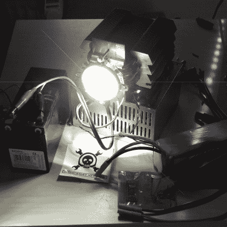

# 怪物 100 瓦 LED 手电筒产生高达 8500 流明！

> 原文：<https://hackaday.com/2014/07/21/monster-100w-led-flashlight-produces-a-whopping-8500lm/>

[Yannick]最近得到了一个 100 瓦的 LED 二极管，就像任何有自尊的黑客一样，他不得不把它变成一个功率大得离谱的闪光灯。

这些二极管的棘手之处在于，它们需要很高的 DC 电压，通常在 32-48V 之间。[Yannick 的]使用 12V 密封铅酸电池，加上 600W 恒流升压转换器，在 3.2A 左右将电压升至 32V。他还设法找到了一个巨大的铝制散热器，以防止二极管过热。一个 120 毫米的风扇有助于保持散热器凉爽，这使得灯可以持续运行，而不用担心烧坏它。但以防万一，他还有一个 Arduino 监控温度——哦，它提供 PWM 控制来调节灯光的亮度！

为了聚焦手电筒，他买了一个合适的透镜和反射镜，可以直接安装在二极管上。在全功率下，LED 发出约 8500 流明的光，这比几乎所有消费类投影仪都要亮，甚至比汽车的远光灯还要亮！

[https://www.youtube.com/embed/1B1QnWO6B7I?version=3&rel=1&showsearch=0&showinfo=1&iv_load_policy=1&fs=1&hl=en-US&autohide=2&wmode=transparent](https://www.youtube.com/embed/1B1QnWO6B7I?version=3&rel=1&showsearch=0&showinfo=1&iv_load_policy=1&fs=1&hl=en-US&autohide=2&wmode=transparent)

这不是[第一次](http://hackaday.com/2014/03/05/monster-100w-led-flashlight-for-under-10/)我们看到一个 100 瓦的 LED 二极管被用作手电筒，但它的构造肯定越来越花哨了！