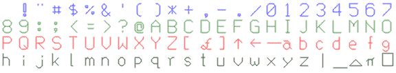

# 逆向工程 Unobtanium

> 原文：<https://hackaday.com/2014/07/21/reverse-engineering-unobtanium/>

如果你听听[Bil Herd]和 Commodore 团队的其他人，你会很快意识到 Commodore 背后的人领先了他们的时代大约 20 年，他们拥有自己的芯片代工厂和垂直整合，这让现代的苹果公司嫉妒。MOS 代工厂生产的一款超酷芯片是 6500/1，用于 Amiga 和 1520 打印机/绘图仪的键盘控制器。基本上是一个具有 6502 内核的微控制器，6500/1 在转储 ROM 内容方面有很多说法，因此 Amiga 的键盘控制器和 1520 绘图仪的字体上的所有代码都是如此——有一些关于如何获取 ROM 内容的想法，但没有人尝试构建一个电路。

[Jim Brain]查看了讨论，最近尝试了一下。[他完全成功了](http://e4aws.silverdr.com/hacks/6500_1/)，丢弃了 6500/1 的 ROM，并允许保存和分析 1520 绘图仪，分析由 6500/1 控制的其他设备，以及创建 unobtanium 6500/1 的嵌入式替代品的可能性。

6500/1 的数据表中有几行描述了测试模式，其中对/RES 行施加+10 VDC 会迫使机器从外部引脚获取存储器。唯一的问题是，没有人知道如何使这个工作。各种想法层出不穷，但直到[吉姆·布雷恩]从他的零件箱里拿出一台 ATMega32，才有人创造出一个工作电路。

AVR 的代码将 6500/1 置于测试模式，从 rom 加载一个单独的内存位置，将数据存储在 PORTA 中，AVR 在 PORTA 中读取数据并通过串行连接将其打印到计算机上。对 6500/1 ROM 中的每个位置重复上述步骤，这样就有了一个固件转储。这大概是 20 年来第一次看到这个代码。

现在，这场竞赛正在进行，以创造一种替代基本上是基于 6502 的微控制器的嵌入式产品。除了经典和复古的场景之外，这可能不会被使用太多，但至少这将是一个有趣的设备。