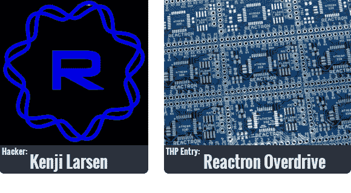
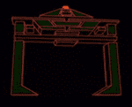

# THP 黑客传记:肯吉·拉森

> 原文：<https://hackaday.com/2014/07/24/thp-hacker-bio-kenji-larsen/>

上周末，我在 HOPE X 与[【Kenji Larsen】](http://hackaday.io/hacker/9748)见了面，我相当确定，在一个满是非常酷的人的会议上，他是最酷的人。与他交谈一会儿，你会感觉到与[巴克米斯特·富勒]、[特斯拉]或任何其他“不被重视，但不被分散在历史中的知情人士”交谈会是什么样子。我会让他回答我们的黑客简历问题来证明这一点。

【贤治】争取黑客奖的项目是[反应管超速驱动](http://hackaday.io/project/1239-Reactron-Overdrive)。他在这里建造的不仅仅是一个电路板，而是一整套传感器、接口和节点，构成了一个完整的人与机器(注意复数“机器”)的接口。当你考虑到没有人知道物联网到底是什么，而且[Kenji]正在研究物联网 3.0 时，你会觉得这里真的有东西。此外，他的项目日志中有一个*创*识别器。那肯定是有意义的，对吧？

下面面试/简历。

Culinary arts, both sides of it. I love to make food, and love to consume it; I just really appreciate how diverse it can get.  Lots of schools of thought, from French and Italian standards, to Japanese nature harmony, to chem-technical, to Ayurvedic, and many other things in between, and outside those concepts. I’ve eaten a lot of weird things. Even when it’s awful, I am glad for the experience. I took some courses at the Culinary Institute of America, and I like to tell people “I learned my knife skills at the CIA.”Other hobbies are hiking, flying airplanes, and sailing, but I find I don’t have a lot of time to do these that much anymore. Have to eat, though…

产品和过程开发的数据分析和原型制作。实际上，我认为这是黑客行为。有大量的度量、实验和测试、可视化、模拟和大量的编码。有大量的时间和工作流分析。我分析哪些事情可以异步完成，哪些事情必须在关键路径上完成；什么可以保持开环，什么必须通过反馈来完成。在由几个非线性、异步工作进程支持的每个进程中，通常都有一个“紧急”时期。这让我想到，真的，人类的存在是真正的“关键时刻”，我们应该使用技术和即时制造方法，用同样的非线性优化来增强这种存在。人类体验不仅仅是我们活着时所拥有的东西，它也是我们负责的东西，可以改进、优化，并且确实是我们最重要的产品。这种想法让我尝试用自己的生活流程来做这件事，后来也让我获得了 Hackaday 奖。

小提琴和古董小提琴修复。这是一台足够古老的机器(和艺术品),可以进行真正的自然进化。这个东西由几种不同的木材、动物物质、植物提取物、矿物质和昆虫分泌物制成，它是对你周围各种各样的东西进行黑客攻击以获得最佳产出的定义。最终结果是美丽。年长的需要一些帮助来继续他们美丽的存在。修复不仅仅是修补——在很多方面都更难，因为你必须尊重过去的缺点和卓越之处，忠于你发现的个性。这不仅仅是让机器回到某种标准。我的意思是，这是一部分，但还有更多。也许这是我的激情所在，因为有些事情我还无法量化(尽管我付出了很多努力！)

电缆箱。这么多理由。但事实上这不是我会做的事。可怜的无防御部件最好升级成可怕的机器。

while(1){do_your_own_stuff();}No operating system is the best operating system. Simple loop execution such as in the AVR allows you to optimize as you like.  I totally get the utility of OSs in the sense of drivers and so forth, but uCs do that well enough with libraries. I find that once a system has a name, and is itself a product looking for market share, it feature creeps to serve many varying needs, until there is stuff I don’t want or need.  Then it creeps further until that stuff is not removable. Wait, isn’t that the definition of cancer?If you really press me, I will say Minix.

这是另一个棘手的问题，因为我有几个不同的长椅。在我的原型工作中，我有单独的工作台，用于电子工作、木工、检查/测量、显微镜、真空、高压和缝纫(是的，用于可穿戴设备)。这里还有一个摄影区，但我们不要称之为“长椅”。

I love my o-scopes but they are not the best ones out there, and I love my soldering irons but also, they aren’t anything too special. I love using my optical flat but don’t need to use it very often. I do use my granite surface plate all the time, but it’s just a flat rock.  And of course my Fluke 79 DMM, but as much as I love it, it is unremarkable.The one tool I use at all my stations is something I make myself, out of necessity. It is the pointy stick. You know those fiberglass rods they sell for next to nothing for marking the end of your driveway, so that they stay visible after it snows a lot?  I cut them down to 10 inch lengths and sharpen the ends on the grinder at different angles, then hone them further with finer grits.They are strong and durable, they are chemical resistant, heat-resistant, electrically non-conductive, great for high voltage. They can hold a fairly precise point, with which to

A fiberglass poking device

操纵任何你需要的东西。从推动树脂中的碳纤维布，到拿着你正在 CNC 上加工的东西，到移动你正在显微镜下观察的东西，或者当你焊接时按住微小的东西，或者当你在加工小东西时推动纺织品通过缝纫机，这些都是完全通用的。我有几种颜色，所以如果我在一项工作中需要几种颜色，如果它们需要接触不同的化学物质或其他东西，我可以让它们保持一致。我还通过颜色对角度进行分级，因此在获得之前，我知道我要达到的是什么(异步过程、视觉和识别)——保持工作流利用率。

地壳算不算？(42.)如果我们在谈论一个半导体设计，这是非常艰难的，有这么多。我不得不说，我真的很欣赏 INA128/129 仪表放大器。我的意思是我喜欢 ATMega328P，但这是一个更高层次的东西，更复杂，不需要我得到更多的压力和赞赏。INA128/129 简单、干净，对 ADC 的作用相当于电子显微镜对眼睛的作用。动力进去，高分辨率知识出来，我喜欢。

C++。我认为这是很多因素的最佳妥协。已经这样很多年了。我会接受更好的妥协，但迄今为止还没看到一个。我不喜欢试图通过在幕后以未记录的方式为您做事情来使事情变得简单的语言。这通常是以牺牲性能和失去对过程的控制为代价的。我喜欢直接操纵记忆。

This is not an easy question, because I am constantly re-prioritizing and I figure, anything that falls off the bottom by the time I die was not important enough to get to.  That said, the top items right now are:

*   延长从现在开始到我死亡的时间(并且将生物年龄稳定在一个好的点上)。奥布里·德·格里，你好！请帮助他——如果可以的话，每个人都要帮助他。我在想我能帮上什么忙。所以我想最重要的是，“我能为奥布里·德·格里做些什么？”项目。(如果这一个工作，我将完成更多的项目。)也许只是写这个是通过提高意识有所帮助。[这里是一个 TED 演讲](http://www.ted.com/talks/aubrey_de_grey_says_we_can_avoid_aging)。看，我已经在做这个项目了！
*   建造一个实用的反中子聚变反应堆。人们似乎在这个时候关注硼 11，但我对锂 7 有一些想法，它有很好的横截面，似乎也很有前途。许多人已经为常规的氘反应建造了聚变器，所以这不是幻想——但他们还没有过度统一。看起来事情达到正确的平衡只是时间问题。我认为 Polywell 技术很酷，我只是想有一些时间来进一步研究它。Fusion@home。开源。我相信有人会在我之前发现这一点，这将把它从列表中删除(或至少向下移动)，因为这样它就变成了一个公式——对我来说，发现和实验过程是有趣的部分——你知道，黑客攻击。
*   工程器官，如七泵分布式心脏(如血流 RAID)。但是人们现在正在做这种事情，而且很可能在我之前就开始做了。我没意见，你们走吧，伙计们！以整个肝脏为例。我们必须做得比尸体移植或半个器官捐赠更好。我们知道肝脏是一个可以自行再生的器官！3D 打印，细胞外基质+干细胞，听起来像是一个漏洞，让我们黑了它。如果我觉得自己能做出足够的贡献，这将是我清单上的第二条——事实上，这是第一条的一部分。但据我所知，没有我，这一切都在进行中。这很好，因为这样我就可以专注于任意形态的生物机器人了。主教呼叫国王 7 号。我想是将军会。

Request buffering.  That actually boils down to old-world etiquette, which, far from being an archaic system, simply defined rules of engagement, a standardized people interface.  The style may change, but the concept is valuable.  In modern speak, I try to be polite, and optimize my communication in harmony with the surrounding people and events. Human communication is like an RF mesh network. You need an organizing principle to maximize data transfer to all nodes. (Thanks for listening.)Also, statistics.

It is the one I live and breathe.Computers are tools.  They need to be useful, or step aside (or be upcycled into excellence). They are sophisticated enough now to know when they need extra time to prepare for a task, or when they are failing.  Those things need to be removed from the critical path of human activity, otherwise we are just going to spend our precious moments being maintainers of machines.  Forget that.  When I was younger, one statistic often cited was how many years of our lives the average person would spend in their car commuting.  Now many work from home, and the time taxes are smaller and distributed.  Waiting for machines to boot, to log in, web pages to refresh, “please wait while your updates are being installed”. Really?  Add them up, do the math.  It is worse than dying that much earlier, since you have to sit through it all.  I joke (sort of) that I am trying to make computers “go away” – that seems surprising to some people because I’ve been working with computers my whole life, and my solution to make them go away actually means having many, many more of them. But my project is about freedom of experience, and there are also aspects pertaining to personal data ownership.  It’s definitely in the spirit of the Hackaday Prize; when I read the bit about technology giving individuals the freedom to build the future, where once only large corporations could do something meaningful, I thought, yes, I will do this.I am often really jammed for time, so I started to use my manufacturing process knowledge to optimize it.  It has worked in some ways so far, and I am looking to expand its scope. I’m still as busy as ever, so it is hard to get this stuff documented, but making this a formal entry has forced me to be a bit more rigorous. I think it could benefit a lot of people..

现在我想得到的帮助是如何合理地整合 Debian 上的多种 Kinects。短期目标很明显，但似乎是一个伟大的传感器，可以整合到我的范式中。我确信它很快会被便宜 10 倍、更棒 100 倍的东西取代，但现在，这就是我们所拥有的。

Sure, see my list above, any of them, but for this Prize the fusor is probably the most appropriate. I wouldn’t tackle it for the Prize because of the timeframe.  But if anyone is bold enough to go for it, I will gladly contribute! Maybe engineered organs is closer to practical already though.  Again, I will help if I can!

## 只是需要时间思考！

I’d like to explain my avatar.It’s a symbol related to the Schrödinger wave equation, applied to human and machine interfaces, instead of matter.  We expose our abilities and properties, what we are about, through our communication and cooperation. These interfaces can be harmonic, or vibrationally destructive, which consumes energy. That’s the same for matter, people, or computers. One curve represents machine interfaces, and the other human interfaces. The two together look like a double helix, a good metaphor for what I am trying to do with my THP entry.