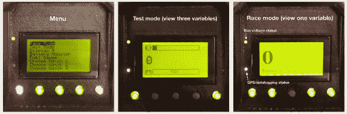
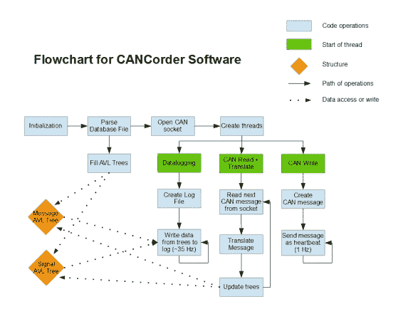

# 自定义 CAN 系统像魔术一样记录摩托车数据

> 原文：<https://hackaday.com/2014/07/24/custom-can-system-logs-motorcyle-data-like-magic/>

俄亥俄州立大学的一个学生团队为一辆 [RW-2x 摩托车](http://current.osu.edu/?q=bikes/rw-2x)设计并建造了一个定制的控制器局域网(CAN)数据采集系统，配有[传感器接口](http://current.osu.edu/?q=node/501)、[骑手显示器](http://current.osu.edu/?q=node/505)和[基于 Linux 的数据记录器](http://current.osu.edu/?q=node/507)。

他们称他们的小而方便的微控制器电路板为神奇的 CAN 节点，它可以测量整个电动汽车的汽车传感器。这包括各种热敏电阻来检查温度的变化。还可以添加一些 0-5V 和 0-12V 传感器来监控制动压力传感器以及一些差分空气压力传感器。由于车辆基本上是一个“滚动电磁噪声炸弹”，他们希望所有这些模拟传感器尽可能靠近声源。

神奇的 CAN 节点基于德州仪器公司的微控制器 TMS320F28035。这使能耗保持在较低水平。

对于信息处理，由[Aaron]领导的团队接入了 F28035 内的内置 CAN 模块。所有 CAN 插头都有两个引脚短接到 GND 或+12V，因此当只连接一个插头时，模拟开关 IC 将在 CAN 线路上连接一个 120 欧姆的电阻。

电路板的其余部分采用国际单位制，但扩展接口是 0.1 英寸中心的 0.1 英寸引脚接头。扩展接头上提供 7 路模拟输入，以及 PWM 输出和数字接口(串行、SPI、I2C)。另外，如果需要的话，可以用一些纸板做一个背包。

软件功能可以通过 can 编程，使其能够通过网络总线接收和响应命令。用户界面由明亮的发光按钮组成，具有独特的功能，按钮会根据电流的流动方式亮起红色或绿色。按钮上的灯指示哪些是活动的。三色表示电机控制器和 GPS/数据记录单元的状态。

将 CAN 总线和数据记录器结合在一起，他们创建了 CANCorder！这是 RW-2x 上的一个设备，它使用了一个 [Beaglebone Black](http://beagleboard.org/black) ，不仅记录了 CAN 总线上的所有数据，还提供了一种快速简单的方法来访问内部的当前数据。它甚至可以找到过去记录的数据。

它是由[Jenn]创造的，他配备了一个定制的斗篷和一个 USB WiFi 加密狗，将比格犬骨变成了 CANCorder。这为他们提供了启动项目的基本功能:这是一种轻松访问 CAN 数据的方式。

他们早期的数据记录目标是通过使用数据库文件来交叉检查 CANCorder 截获的各种 CAN 消息来实现的。他们通过对软件编程来解析一个特殊格式的文件，该文件包含所有 CAN 消息。然后，软件解析的数据必须以一种允许以后快速搜索的方式存储。

选择 AVL 树是因为它可以在插入节点时自我平衡；允许快速搜索。由于添加节点在执行过程中只发生一次，并且节点永远不会被删除，所以这两个操作的低效率不是问题。

欲了解更多 CAN 黑客攻击，请查看此[CAN 和汽车黑客攻击介绍](http://hackaday.com/2013/10/21/can-hacking-introductions/)。