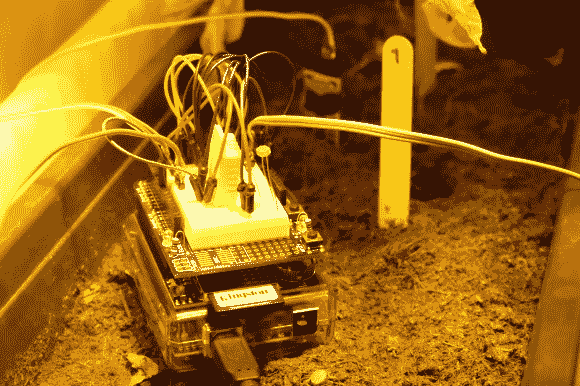
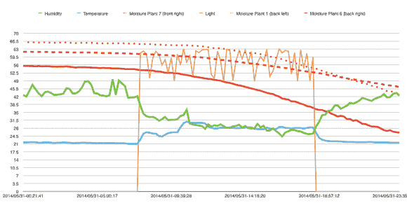

# 这款 Arduino 连接非常适合微型发电

> 原文：<https://hackaday.com/2014/07/25/this-arduino-hookup-is-perfect-for-microgrowery/>

只需要一粒小小的种子。一粒小小的种子，当它被种到地里并得到正确的滋养时，可以茁壮成长为一棵健康快乐的植物。但是这涉及到一些挑战。例如，保持稳定的温度和最佳的湿度有时会很困难，尤其是在刚开始的时候。

[这款 Arduino grow-op 监控解决方案](http://www.reddit.com/r/microgrowery/comments/270m1l/arduino_grow_monitor/)有助于解决这些问题。它是由[growershower]建造的，作为一个有趣的辅助项目，用来监测 3 种大麻植物的生命体征。该板是一个 Uno，有一个 SD 卡屏蔽，带有一个 [DHT22 温度传感器](http://www.hobbyist.co.nz/?q=dht-22)和一个土壤湿度传感器。光电二极管也用于测量光线。

从数据中产生的图表是一个杂草种植者的梦遗:

湿度、温度、湿度和光线都可以定期记录到系统中。这种经验数据收集是跟踪植物生长状况的关键，让种植者可以选择做出有根据的改变。

显然这些传感器和附带的线缆都不防水，浇水的时候需要拆下来，非常不方便。然而，随着越来越多的人参与到设计中来，这个系统会随着时间的推移而不断完善。[growershower]计划为下一次种植用某种树脂密封电子设备。此外，使用 Raspberry Pi 代替 Arduino 将允许[growershower]通过网络浏览器远程实时检查数据。

之后的下一步将是开灯和通风。浇水时间表也可以包括在内。只是在等式中加入 H2O 时要小心，尤其是在处理与生长灯相关的高电压时。你不想意外地让自己被遗忘吧！安全第一。安全第一。

* * *

**编辑注释** **:** 编辑人员在考虑以下事项后选择发表这篇文章:首先，这个项目收集和绘制数据既有趣又在其他应用中有用。其次，种植大麻在某些司法管辖区是合法的。