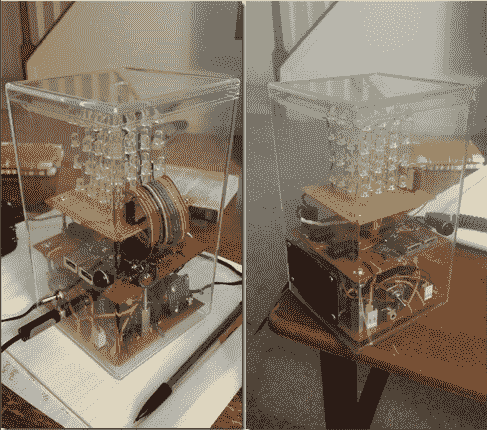

# LED 立方体在一个细长的立方体被干扰

> 原文：<https://hackaday.com/2014/07/26/led-cube-in-an-elongated-cube-be-jammin/>

我们得到了很多关于 LED 立方体的提示。它们是探索许多不同事物的绝佳选择，从电路设计到电流源和吸电流，当然还有固件。为什么我们在头版上看不到一百万张呢？好吧，我们已经看到了很多，但大多数发送给我们的东西并没有展示出这样一个干净的构建。很明显，[贾斯汀]对他在这个 4x4x4 单色立方体上的工作感到非常自豪。

隐藏在其中一个原型板下的是驱动它的 Arduino。许多组件都是从他所在大学的电子垃圾箱中回收的。这包括他用来给设备供电的 12V 交流电壁式电源插座。桥式整流器转换为 DC，除了为 led 供电外，还有几个 USB 充电端口。休息后，你可以看到和听到它的行动。立方体会随着音乐跳动，但如果你想在灯光秀中享受宁静，只需按下开关就能切断扬声器。

如果你正在寻找一个挑战，[这个 8x8x8 的 RGB 产品](http://hackaday.com/2012/04/06/the-best-led-cube-build-weve-seen/)更难完成几个数量级…如果你决定冒险一试，要留出很多额外的时间。我们还听说[板凳队员]可能会尝试用一些[通孔 ws2812 像素](http://hackaday.com/2014/02/22/breadboardable-ws2812-leds/)制作一个立方体。

[https://www.youtube.com/embed/niK4PejIaKk?version=3&rel=1&showsearch=0&showinfo=1&iv_load_policy=1&fs=1&hl=en-US&autohide=2&wmode=transparent](https://www.youtube.com/embed/niK4PejIaKk?version=3&rel=1&showsearch=0&showinfo=1&iv_load_policy=1&fs=1&hl=en-US&autohide=2&wmode=transparent)