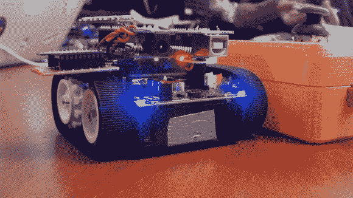
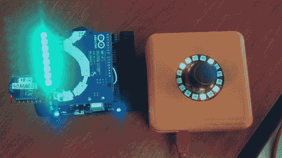
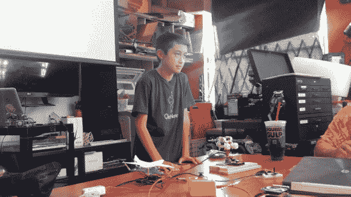

# 遥控白宫机器人

> 原文：<https://hackaday.com/2014/07/27/the-rc-white-house-robot/>

这个基于 Arduino 的遥控机器人是由一个名叫[Quin]的年轻学生创造的，他喜欢在 hackerspaces 教授电子课程。这是由这个令人敬畏的、快速的、完全自主的迷你 Roomba 改装而成的，它已经在首届白宫创客节期间驶入了总统大楼。

这种快速、小巧的设备使用带有 XBee 无线模块的机器人底盘套件，以便控制器和机器人可以连接在一起。一个 NFC 屏蔽被砍成两半，以便将电线焊接到位。

[Quin]的目标是开发一个有趣的游戏，记录机器人驶过平坦表面上的 NFC 标签的次数。分数以闪烁的灯的形式显示，当设备经过传感器时，灯就会发光，记录分数。

控制器容器是用一种叫做 Bukobot 的开源 3D 打印机制成的。该外壳包含一个 Arduino 和另一个 XBee 盾，以及一个操纵杆和一个 neopixel 环，使其具有漂亮的抛光外观，并配有一圈漂亮的闪烁 LED。

我们在帕萨迪纳一家名为 Deezmaker 的当地 3D 打印商店/制造商空间的 Arduino 研讨会上看到了机器人的行动。[Quin]告诉我们音乐家 will.i.am 在华盛顿州 DC 市的创客集会上尝试过。他还说他也在那里遇到了科学家比尔·奈。

这个简单的项目，以及他的更多发明，打开了创客社区的许多大门。然而[奎因]似乎并没有被所有的关注所影响，他仍然非常专注于向任何渴望学习的人传授他的技能。

该项目的文档在他的网站上( [Qtechknow](http://www.qtechknow.com/) )和这个[变色圣诞星](http://www.instructables.com/id/Color-Changing-Christmas-Star/)；这非常适合装扮节日圣诞树。另一个项目是这个[甲烷感应屁帽](http://hackaday.com/2012/05/04/the-gas-cap-senses-your-flatulence-and-displays-it-on-your-forehead/)。这三个都可以在下面的照片中看到。

接下来是机器人演示视频。在这本书里，[奎因]讲述了被邀请进白宫的感受。

[https://www.youtube.com/embed/I0uwgSRWsvs?version=3&rel=1&showsearch=0&showinfo=1&iv_load_policy=1&fs=1&hl=en-US&autohide=2&wmode=transparent](https://www.youtube.com/embed/I0uwgSRWsvs?version=3&rel=1&showsearch=0&showinfo=1&iv_load_policy=1&fs=1&hl=en-US&autohide=2&wmode=transparent)

另外，看看这个关于[Quin]的创造者运动的精彩视频。

[https://www.youtube.com/embed/e9lvW6ZY-Gs?version=3&rel=1&showsearch=0&showinfo=1&iv_load_policy=1&fs=1&hl=en-US&autohide=2&wmode=transparent](https://www.youtube.com/embed/e9lvW6ZY-Gs?version=3&rel=1&showsearch=0&showinfo=1&iv_load_policy=1&fs=1&hl=en-US&autohide=2&wmode=transparent)

另外，这里有一篇[科普文章](http://www.popsci.com/technology/article/2013-08/short-circuit)和《Make》杂志关于他的这个[专题。](http://makezine.com/2014/06/18/qtechknow-knows-the-white-house/)