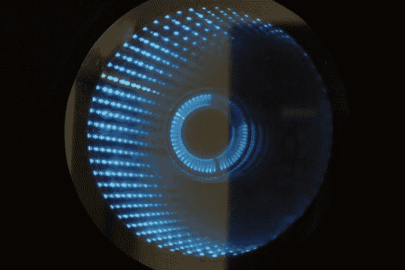

# 无限镜像时钟:在某处有一个时间笑话

> 原文：<https://hackaday.com/2014/07/29/infinity-mirror-clock-theres-a-time-joke-there-somewhere/>

我们不认为我们以前见过无限镜像时钟，但是我们喜欢这种在旧的最爱上的新变化。不同的颜色可以区分秒、分和小时，另外一个红外传感器可以检测到有人直接站在时钟前面，并关闭 led，使它可以用作普通的镜子。这是[Dushyant Ahuja]的作品，他对用发光二极管组装时钟并不陌生。只要看一眼[的第一个项目](http://www.instructables.com/id/Charliexplexed-LED-Clock-Arduino/)，你就能知道他在镜像时钟方面取得了多大的进步，这是一个令人印象深刻的由电线和胶水混合而成的作品。

[Dushyant]已经为他的新时钟加快了步伐，沿着圆形框架的内部安装了一个 LED 灯条，以形成无限镜面效果。这些灯接收来自附加的自制 Arduino 板的信号，该板还连接到实时时钟(RTC)模块以记录时间，并连接到蓝牙模块，这使得[Dushyant]可以无线编程时钟，而不必在时钟需要调整时拉出一些线缆。

跳完后留下来看一个快速演示视频。灯光看着刺眼；[Dushyant]在圆圈中心插入一块不锈钢板，以反射 led 的外缘。在一个快速的彩虹效果之后，看起来镜子进入了时钟模式。看看你能不能算出现在是什么时间。要想一步一步地了解这个项目，请浏览他的[指导页](http://www.instructables.com/id/Infinity-Mirror-Clock/)。

[https://www.youtube.com/embed/2U2OjMVxfO8?version=3&rel=1&showsearch=0&showinfo=1&iv_load_policy=1&fs=1&hl=en-US&autohide=2&wmode=transparent](https://www.youtube.com/embed/2U2OjMVxfO8?version=3&rel=1&showsearch=0&showinfo=1&iv_load_policy=1&fs=1&hl=en-US&autohide=2&wmode=transparent)

[https://www.youtube.com/embed/4yXxBPCq0zA?version=3&rel=1&showsearch=0&showinfo=1&iv_load_policy=1&fs=1&hl=en-US&autohide=2&wmode=transparent](https://www.youtube.com/embed/4yXxBPCq0zA?version=3&rel=1&showsearch=0&showinfo=1&iv_load_policy=1&fs=1&hl=en-US&autohide=2&wmode=transparent)