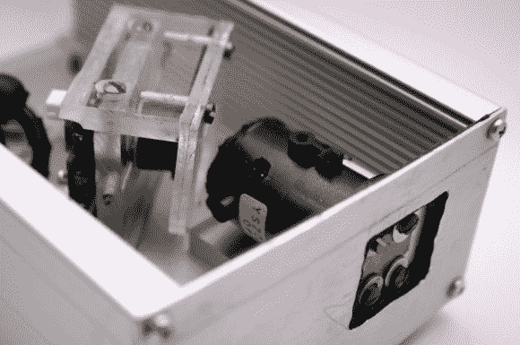

# DIY USB 光谱仪实际工作

> 原文：<https://hackaday.com/2014/07/31/diy-usb-spectrometer-actually-works/>

当我们听到光谱仪时，我们通常会想到 CSI 实验室中的一些高端测试设备。当然，如果一个黑客用心去做，他或她也能做出一个。但是用一个摄像头，一些从易趣上买来的廉价衍射光栅和一些废料做一个怎么样？[肯定不是](http://renaud.schleck.free.fr/spectrometre.php)。

[Renaud]凭借对分光计工作原理的详细了解，完成了这个像 MacGyver 一样的构建。衍射光栅用于将入射光分成其波长成分。就像棱镜一样。然后波长通过一个狭缝，狭缝由两片高度抛光的黄铜制成，因此网络摄像头传感器可以看到特定的波长。虽然摄像头光谱仪的概念[并不新鲜](http://hackaday.com/2012/08/27/turning-a-webcam-into-a-spectrometer/)，但它的建造仍然令人印象深刻。

一旦构建完成，[Renaud]就组装一些软件来理解数据。虽然在细节上有点欠缺，但我们希望这个版本能激发你制作自己的光谱仪，并在 [hackaday.io](http://www.hackaday.io) 上记录下来。