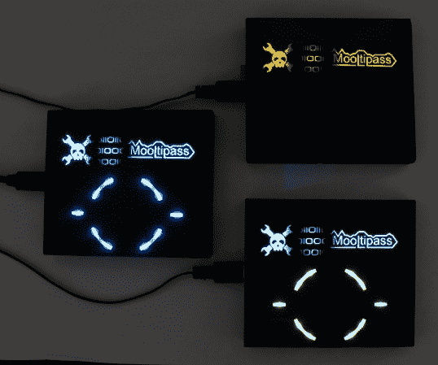

# 在 Hackaday 上开发:Beta 测试人员、动画和组装视频

> 原文：<https://hackaday.com/2014/07/30/developed-on-hackaday-beta-testers-animation-and-assembly-videos/>

我们很确定我们的大多数读者现在已经知道了，但我们还是要告诉你:Hackaday 社区(作者和读者)目前正在开发一个离线密码管理器，即[mool pass](http://hackaday.io/project/86-Mooltipass)。一个月前，我们发布了我们的[第一个演示视频](http://hackaday.com/2014/07/02/developed-on-hackaday-demonstration-video-and-feedback-request/)，从那时起，开发团队一直相当忙碌。

首先:我们听到了(嗯，读了)你在我们的[以前的文章](http://hackaday.com/tag/developed-on-hackaday/)中留下的评论，并决定制作一个小的动画视频，希望能解释为什么有一个离线密码管理员是一件好事。我们欢迎您来看看我们的[剧本草稿](https://docs.google.com/document/d/1ddnvdAIQ7bqyml_SvA-WC7rn3iMLgdxCZAsHr7k25Q8/pub)，并告诉我们您的想法。我们更新了我们的 [GitHub 自述文件](https://github.com/limpkin/mooltipass)，更重要的是更新了我们的常见问题解答，所以如果您还有一些我们没有回答的问题，请随时告诉我们。我们终于发现了一篇简短但有趣的[论文](https://isecpartners.github.io/whitepapers/passwords/2013/11/05/Browser-Extension-Password-Managers.html)关于基于软件的密码保持器可能存在的安全缺陷。

其次，已经成功组装了 20 多台原型机，一些 beta 测试人员已经收到了它们。由于他们为自己的单位出资，我们为他们提供了选择蓝色、绿色、黄色或白色有机发光二极管屏幕的可能性(见上图)。因此，我们希望事情会加速，因为我们将有用户(或者更确切地说是老板)推动我们改进我们当前的平台，并实现急需的功能。

最后，我想我们的一些读者可能会感兴趣，我做了一个原型组装过程的快速视频(嵌入下面)。它仍然有点粗略，将进行一些更改以使其更易于生产。我们预计接下来的几周将充满有趣的事件，因为我们的 beta 测试人员/ Hackaday 读者将能够对我们已经做了这么久的工作进行评判。我们强烈建议您订阅我们的官方谷歌群,以了解我们探险的最新进展。

[https://www.youtube.com/embed/xTOw-sVSXzQ?version=3&rel=1&showsearch=0&showinfo=1&iv_load_policy=1&fs=1&hl=en-US&autohide=2&wmode=transparent](https://www.youtube.com/embed/xTOw-sVSXzQ?version=3&rel=1&showsearch=0&showinfo=1&iv_load_policy=1&fs=1&hl=en-US&autohide=2&wmode=transparent)