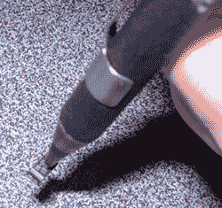

# 这个 Hackaday 奖的参赛作品烂透了

> 原文：<https://hackaday.com/2014/07/31/this-hackaday-prize-entry-sucks/>

[k . c . Lee]正忙着参加 Hackaday 奖，现在他正在处理许多集会。对他来说，这意味着微小的 SMD 部件，他从 DealExtreme 订购的真空笔还没有到货。解决办法？[和其他遇到这种情况的人一样](https://hackaday.io/project/1347/log/5056):为水族馆找一个气泵。

在合适的工具有时间从中国到达之前，为了快速建造，[K.C.]用了一个旧的鱼泵，并对其进行了改造以进行抽吸。他没有对泵进行精确的修改，但这可以像钻一个孔并在其中填充一些硅胶管一样简单。

这种真空笔的“工具”是一种塑料一次性 0.5 毫米自动铅笔。[K，C.]发现这在小至 0402 封装的较小零件上工作良好，但表面光滑的沉重零件(例如芯片)对于自动铅笔和水族箱泵来说太难处理了。