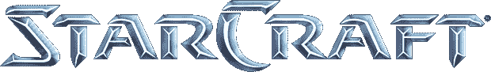

# 在手臂上玩星际争霸

> 原文：<https://hackaday.com/2014/07/31/playing-starcraft-on-an-arm/>

除了真正可怕的任天堂 64 端口，星际争霸一直都是绑定台式机和笔记本电脑的。暴雪可以获得星际争霸的代码，将其移植到 ARM 平台上，在 Google Play 和 iTunes 商店上发布一个版本，然后坐以待毙。然而，这将意味着大量的开发人员时间，以及潜在的数年追踪难以发现的错误。

或者网上随便一个人[就可以把星际争霸移植到 ARM 平台上](http://boards.openpandora.org/topic/15820-starcraft/)。是的，这意味着所有你可能想要的虫族快攻和黑暗圣堂伏击都可以用平板电脑和覆盆子。

这个编译器魔术般的演示是 OpenPandora 团队[notaz]历时数月的项目。没有了《星际争霸》的源代码，[notaz]被迫反汇编了游戏的 Win32 版本，用一些自定义工具将反汇编转换成 C，并为 ARM 重新编译，同时从 Wine 的 ARM 端口链接所有必要的 Win32 API 调用。说这不容易是轻描淡写。

如果你有一个 OpenPandora，想要重温你年轻时的快乐时光，你可以在这里得到你需要的一切。对于任何一个没有 OpenPandora 而想在 Raspi 上玩星际争霸的人来说，你可能需要重新编译你自己的端口。下面视频。

[https://www.youtube.com/embed/7vWnyDrNQO4?version=3&rel=1&showsearch=0&showinfo=1&iv_load_policy=1&fs=1&hl=en-US&autohide=2&wmode=transparent](https://www.youtube.com/embed/7vWnyDrNQO4?version=3&rel=1&showsearch=0&showinfo=1&iv_load_policy=1&fs=1&hl=en-US&autohide=2&wmode=transparent)