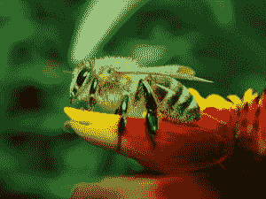
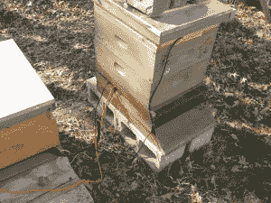
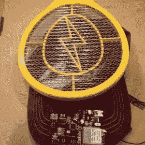
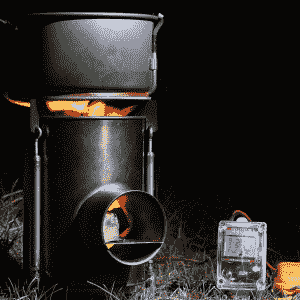

# Hacklet # 9 Bugs 和 Fire

> 原文：<https://hackaday.com/2014/08/01/hacklet-9-bugs-and-fire/>

本周在 Hacklet 上，我们将花些时间来看看 bug 和 fire！  首先，我们有请【诺尔】和[一起拯救蜜蜂。蜜蜂对地球生态系统和我们人类赖以生存的食物链都非常重要。不幸的是，蜜蜂对人类排放到大气中的一些化学物质也很敏感。有时它会产生有色蜂蜜，但更多时候它对蜜蜂有害。](http://hackaday.io/project/1586-Bee-O-Neo-Tweet-O)

新烟碱类杀虫剂是一种杀虫剂，已经给使用它们的地方附近的蜂巢带来了问题。[Noel]依靠铋电极制造的传感器来探测蜂巢入口附近的化学物质。世界各地的养蜂人可以收集这些数据，并将其发送到中央服务器。他使用 Arduino Yun 作为 WiFi 连接基站。每个单独的蜂巢都有一个 Adafriut 饰品和一个 433MHz 的无线电链路来发送数据到基地。[Noel]甚至希望通过蜜蜂拍打翅膀的声音来探测它们。

[Ken]在养自己的蜜蜂，他想监测的不仅仅是化学物质。他的蜜蜂蜂箱监控系统跟踪他的蜂箱的温度和重量(以及产生的蜂蜜)。[Ken]没有购买昂贵的称重传感器，而是改装了一台标准的数字浴室秤来满足他的需求。在 [Apitronics](http://hackaday.io/post/4424) 平台和一只猎兔犬的帮助下，这些昆虫连接到了蜜蜂网络。肯甚至用 Apitronics 系统增加了一个太阳能气象站。

 【迈克】采取了一种略有不同的方法。他不想救虫子，他想杀死那些让他讨厌的虫子！[迈克]不想弄脏自己的手，所以他发明了[懒人黑仔 9000](http://hackaday.io/project/2215-Lazy-Killer-9000) 来轻松消灭虫子。懒惰的黑仔使用带电苍蝇拍的商业端来完成它的工作。没有 Arduino 这个项目是不完整的，所以[Mike]正在添加一个，以及一个 WiFi 盾。整个系统将有一个友好的界面来打开果汁。懒惰的黑仔的一个最好的特点是互联网连接杀死计数。[迈克]知道在真空的太空中没有任何虫子，所以他参加了[黑客大奖](http://hackaday.io/prize)的“懒惰黑仔”。

从虫子，我们转移到火！[JB . SWE 先生]需要一个可靠的便携式电源。他在磷酸铁锂电池中发现了这一点，但仍然需要一种充电方法。为此，他发明了多充电器 T1，这是一种瓦特表和充电器，可以由太阳能、风能或温差能供电。一个[电源供应器 X](https://www.kickstarter.com/projects/david-toledo/the-powerpot-x-most-reliable-10-watt-portable-gene) 提供火和能量给电池充电。充电器将其转换成锂化学电池所需的标准恒流- >恒压充电系统。多充电器还不是一个完整的电池管理系统，但它已经上路了。

蜡烛已经成为婚礼上的主要物品。[Quinn]通过对经典的 unity candle 的拍摄，将事情推向了一个新的高度并超越了[。这根蜡烛将火球抛向 30 英尺高的天空！我们在六月的时候就报道了 T4，但是从那以后奎恩就一直很忙。经过 20 多次更新，[Quinn]已经在](http://hackaday.io/project/1039-Unity-Candle) [Hackaday.io](http://hackaday.io/) 上创建了一个记录最完整的项目。当然，这个项目是处理丙烷和巨大的火灾，[奎因]提到你不应该尝试，除非你真的知道你在做什么。不要放火烧任何新娘！这就是本周的 Hacklet！下周，相同的黑客时间，相同的黑客频道，为更多的最好的 [Hackaday.io](http://hackaday.io/) ！