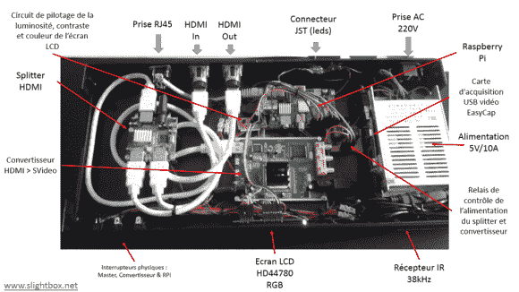

# Raspi 流光溢彩集成在一个 19 英寸机架中，包含大量外围设备

> 原文：<https://hackaday.com/2014/08/02/raspi-ambilight-integrated-in-a-19-rack-packs-lots-of-peripherals/>

流光溢彩系统在您的显示器周围产生与您正在播放的视频内容相对应的灯光效果。[Sébastien] [只需构建他的](https://translate.google.com/translate?sl=auto&tl=en&js=y&prev=_t&hl=en&ie=UTF-8&u=http%3A%2F%2Fsebastien.warin.fr%2F2014%2F07%2F31%2F1549-slightbox-v3-la-version-hdmi%2F&edit-text=)(法语翻译成英语，原文[此处](http://sebastien.warin.fr/2014/07/31/1549-slightbox-v3-la-version-hdmi/))并将所有元素嵌入他从法内尔购买的 19 英寸机架中。

正如我们多年来讨论的大多数流光溢彩系统一样，HDMI 信号首先被分成两部分，一部分被发送到他的显示器，而另一部分被转换成 S-Video 信号。然后用连接到树莓皮的 STK1160 棒捕获后者。使用 OpenCV 库的 python 脚本负责提取帧像素，并计算出哪些颜色应该发送到 SPI 连接的 LPD8806 LEDs。一个漂亮的网络界面也允许从任何连接到他的本地网络的平台驱动 led。最后，一个标准的 HD44780 LCD 和一个红外接收器连接到 raspberry，使[Sébastien]能够控制和监控他的平台。有趣的是:他还不得不使用两个继电器来循环他的 HDMI 分离器和转换器，因为它们经常崩溃。休息之后，您可以观看之前版本的演示视频。

[https://www.youtube.com/embed/bN1yyEI4WpM?version=3&rel=1&showsearch=0&showinfo=1&iv_load_policy=1&fs=1&hl=en-US&autohide=2&wmode=transparent](https://www.youtube.com/embed/bN1yyEI4WpM?version=3&rel=1&showsearch=0&showinfo=1&iv_load_policy=1&fs=1&hl=en-US&autohide=2&wmode=transparent)