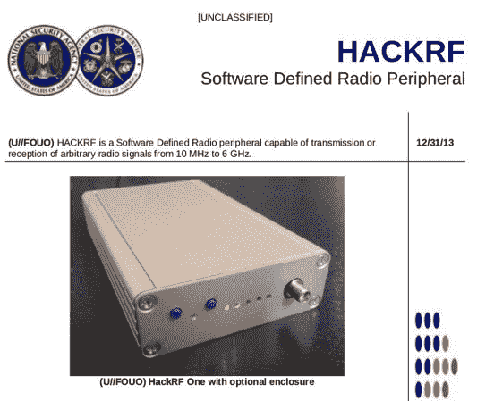

# 构建国家安全局的工具

> 原文：<https://hackaday.com/2014/08/01/building-the-nsas-tools/>

早在 2013 年，国家安全局的蚂蚁目录就被泄露了。这份文件包含了一份可供 NSA 监控的设备清单。

[Michael Ossmann]看了看这个，意识到他们的很多工具都类似于开源硬件社区构建的设备。基于此，他在 Toorcamp 2014 上做了一个关于国家安全局的演讲。这涵盖了如何使用开放硬件实现这些设备。

上图是对 ANT 目录页面的模仿，展示了[Michael]的 [HackRF](https://greatscottgadgets.com/hackrf/) ，一个开源软件定义的无线电。在演讲中，[Michael]和[Dean Pierce]逐一介绍了 ANT 目录设备，讨论了构建自己的设备所需的硬件。

其中一些工具已经有了开源的对应工具。床头柜 WiFi 开发工具本质上是一个 [WiFi 菠萝](https://wifipineapple.com/)。麻雀二号或多或少是一个运行 [Kismet](http://www.kismetwireless.net/) 的设备，连接到一架无人机上，我们[在](http://hackaday.com/2010/08/18/drone-cracks-wifi-from-on-high/)之前见过。

在[Michael]的博客上可以看到 Toorcamp 演讲的视频。下周的 DEFCON 大会上也会有各种关于这个主题的演讲，我们对此很期待。为了进一步阅读，维基百科对[蚂蚁目录](http://en.wikipedia.org/wiki/NSA_ANT_catalog)有一个很好的总结。