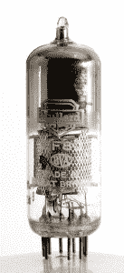

# Retrotechtacular:我们听说你喜欢电子管，所以这里有一部来自 Webtubes 的关于电子管的电影

> 原文：<https://hackaday.com/2014/08/05/retrotechtacular-we-heard-you-like-tubes-so-heres-a-film-about-tube-tubes-from-the-webtubes/>

这个可爱的小数字是 EF80 五极管热离子阀，或真空管，由 Mullard 于 1950 年开始制造。它们被用于无线电和雷达应用，但大部分被用于甚高频电视机。本周的《回顾》杂志特别关注 EF80 的[组装和现场材料生产。](http://www.youtube.com/watch?v=dErsA6wFmlM)

影片以缓慢而小心的手工组装 EF80 开始。阴极被插入到云母片中，一系列的三个栅格被放置在阴极上。半圆形阳极位于最外面的栅极周围。另一个云母片放置在顶部，它具有三重功能，作为垫片、[吸气剂](http://en.wikipedia.org/wiki/Getter)/板组件的基座和防止吸气剂闪光的防火墙。灯管上部的黑色衬里是气化吸气剂的残留物，在第一阶段除气后加热。

在抽真空开始之前，内部组件安装在一个玻璃基座上，带有九个预先弯曲的引脚，以满足内部组件导线。添加加热器、散热罩和网状圆柱体，然后在其板上添加吸气剂。将管子套在组件上，并在夹具中熔合到基座上，形成气密密封。

看过组装后，你会对内部材料生产有更好的认识。这种方法有助于对大量相同规格的阀门进行更好的质量控制。Mullard 煮他们自己的玻璃，并把它拉成长棒。这些是逆着控制直径和厚度的内部气流形成的。杆被切成较短的长度，并制成一端封闭的球状物。最后，用来吸出空气的管子被接上，灯泡被退火。用一对电极之间的高压放电测试每个灯泡。

也许生产中最令人印象深刻的部分发生在钨部门。每个阀门中的加热器开始时是一团白钨矿，在球磨机中待了七天。它经过化学处理制成钨粉，然后压制成棒，在氢气和高电流下回火。棒材分几个阶段被拉成直径为 1/50 英寸的丝。然后用金刚石模具越拉越长。一根钨棒最终被拉成 200 英里长的金属丝。

每个部件在由灵巧、纤巧的女性组装之前，都要经过无数次自动化和人工测试。然后，当然，他们会接受更多的测试。

[https://www.youtube.com/embed/5WCWejeRR_s?version=3&rel=1&showsearch=0&showinfo=1&iv_load_policy=1&fs=1&hl=en-US&autohide=2&wmode=transparent](https://www.youtube.com/embed/5WCWejeRR_s?version=3&rel=1&showsearch=0&showinfo=1&iv_load_policy=1&fs=1&hl=en-US&autohide=2&wmode=transparent)

[感谢赫德利发来此信]

Retrotechtacular 是一个每周专栏，以旧时的黑客、技术和媚俗为特色。通过[发送您对未来分期付款的想法](mailto:tips@hackaday.com?Subject=[Retrotechtacular])，帮助保持新鲜感。