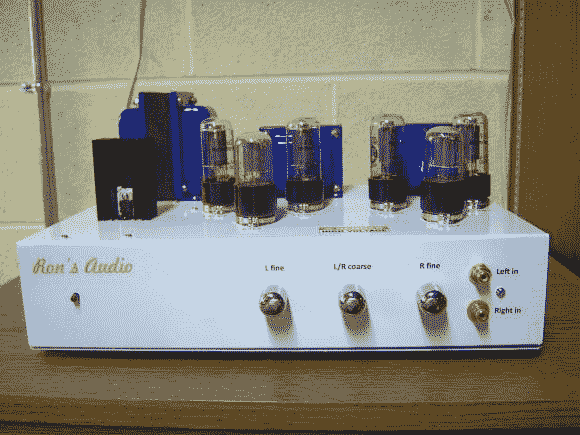

# 设计精美的立体声电子管放大器

> 原文：<https://hackaday.com/2014/08/02/a-nicely-designed-stereo-tube-amp/>

[Ron]过去对真空管和固态电子器件所做的大部分工作都是修复性的。在 59 岁的时候，他终于组装好了他自己的立体声电子管放大器，我们不得不承认它确实有一个令人敬畏的外观。

该平台是围绕众所周知的[6 V6](http://en.wikipedia.org/wiki/6V6)[beam-power](http://en.wikipedia.org/wiki/Beam-power)[四极管](http://en.wikipedia.org/wiki/Tetrode)构建的，这些四极管如今大多被各大音频品牌用于其吉他功放。基于 Dynaco 6V6 电路的 PCB 是从中国购买的，并对其进行了微小的改动。放大器使用一个变压器将 US 120VAC 转换为 240VAC 和 9VAC，第一个由玻璃器皿 PS-14 电源整流，而后者转换为管式加热器的 6.3V 调节电压。输出级由两个 Edcor 音频变压器(每个通道一个)组成，为其 8 欧姆扬声器转换高压。自制的底盘提供了适当的接地，因此你听不到任何背景噪音。

我们很想知道我们的一些读者是否已经在尝试音频应用的玻璃管。请在下面的评论区告诉我们你的体验。