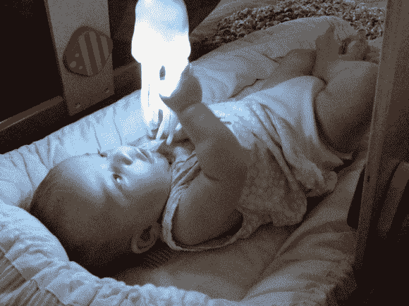
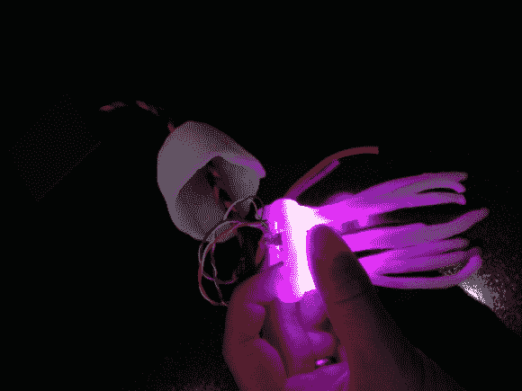

# 催眠水母对孩子来说很棒(内心也是孩子)

> 原文：<https://hackaday.com/2014/08/02/hypno-jellyfish-is-great-for-kids-and-kids-at-heart/>

LED 很有趣。它们很容易被看到，不太难被勾住，并且发出可以被凝视几个小时的美丽光芒。孩子们喜欢它们，所以当[Jens]的女儿出生时，他知道他想创造一个根据物体的运动来改变颜色的装置。

他利用一个 [mpu6050 加速度计](http://playground.arduino.cc/Main/MPU-6050)来检测位置的变化，并将一个 Arduino Nano、一个 9V 电池和一个 adafruit 的 12 LED neopixel 戒指连接在一起。设计要求事先被草草记下，以确保任何玩催眠水母的孩子不会受到任何伤害。例如，任何能放进孩子嘴里的东西，都会放进那个孩子的嘴里；这意味着使用的任何材料必须无毒，足够大而不会被吞咽，并且防流口水/防水。孩子们会拉、扔、掉玩具，所以所有的东西都必须坚固耐用。癫痫也是处理 LED 时的一个问题。但是，[Jens]项目击中了目标，制作了一些对孩子友好的东西，同时也让其他喜欢变色灯的人感到愉快。

所涉及的步骤是从剥去电线并把它们插入帕拉科德线开始的。接下来，电子设备被安装到位；随后用加热到 60 摄氏度以上的多形态塑料制作水母，将其转化为柔软半透明的材料，可以手工制作。最终结果看起来像这张照片。

在塑造好水母之后，这个过程的最后一步是代码，它基于 [i2cdevlib](https://github.com/jrowberg/i2cdevlib/tree/master/Arduino) 和 [Adafruit 的新像素库](https://github.com/adafruit/Adafruit_NeoPixel)。上传的作品可以在[的 Github repo](https://github.com/clarholm/Hypno-Jellyfish) 中找到。

现在，如果你没有孩子，你可以随时开发这个项目来画光。下面可以看到一个可能的例子，字母是由优雅地漂浮在空中的水母拼出的。

下面嵌入了演示视频:

[https://www.youtube.com/embed/0sC9Ga-qVCA?version=3&rel=1&showsearch=0&showinfo=1&iv_load_policy=1&fs=1&hl=en-US&autohide=2&wmode=transparent](https://www.youtube.com/embed/0sC9Ga-qVCA?version=3&rel=1&showsearch=0&showinfo=1&iv_load_policy=1&fs=1&hl=en-US&autohide=2&wmode=transparent)