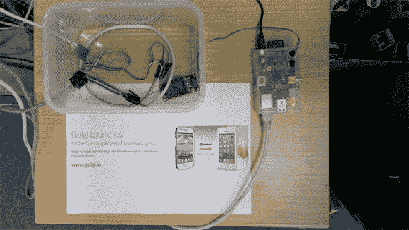

# 用手机开门——轻而易举！

> 原文：<https://hackaday.com/2014/08/05/unlocking-a-door-with-a-phone-easy-as-pi/>

[Ian]为他的办公室同事创造了一种进入门内的方法，即使他们忘记带钥匙。这个[办公自动化，Raspberry Pi 设置](http://blog.golgi.io/build-an-app-that-opens-doors-easy-as-pi)被恰当地命名为“门卫”并提供了解锁进入系统的替代方法。

他的解决方案接入了现有的安全电路，该电路由一个简单的继电器闭合，该继电器连接到硬件的主要部分；覆盆子馅饼。Pi 的一端是 GPIO 引脚，允许控制访问，而另一端链接到互联网。公司的内部系统负责认证用户、发放密钥和处理访问请求。移动客户端，也就是智能手机，可以向门卫索要一套钥匙。

[Ian]使用 [Golgi SDK](http://www.golgi.io/) 来加速内部应用程序的开发。随着电线的到位，看门人取得了巨大的成功，现在忘记带钥匙已经成为过去。尽管工作人员不再需要进入办公室打扰他们的同事，开发团队已经计划加强他们的办公自动化系统。已经有其他的创新被创造出来与门卫相结合。

现在剩下的就是展示门卫的视频演示了，休息之后可以看到:

[https://www.youtube.com/embed/3dJso1m9sVM?version=3&rel=1&showsearch=0&showinfo=1&iv_load_policy=1&fs=1&hl=en-US&autohide=2&wmode=transparent](https://www.youtube.com/embed/3dJso1m9sVM?version=3&rel=1&showsearch=0&showinfo=1&iv_load_policy=1&fs=1&hl=en-US&autohide=2&wmode=transparent)